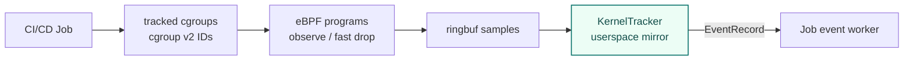

# eBPF Runtime

**eBPF Runtime** is the architectural term for the end-to-end layer that
observes CI/CD job process, network, file, domain, and HTTP activity. There is
no `eBPFRuntime` or `KernelRuntime` type or package. The implementation is split
across kernel-loaded programs in `internal/agent/bpf`, kernel-facing I/O in
`internal/agent/kerneltracker/kernelio`, and userspace tracking and attribution
in `internal/agent/kerneltracker`. The kernel baseline is Linux `5.15+`.

## Why cgroup v2 tracking

When monitoring CI/CD runtime, deciding **how much of the OS to observe** is the core design tradeoff.

| Approach | Strength | Weakness |
| --- | --- | --- |
| Watch the whole host | Few blind spots | Noisy: runner host, system daemons, unrelated workloads — hard to interpret in CI/CD context |
| Watch only the job's processes by PID lineage | Quiet | Misses work that goes through a container runtime or a host-side helper process |
| **cgroup v2 membership (cicd-sensor)** | Quiet for normal CI/CD activity, while still catching container workloads through staging promote | Cannot follow work that escapes into another host-side process; those escape patterns are handled as runtime events instead |

cicd-sensor uses cgroup v2. Kernel hooks check whether the current cgroup is in `tracked_cgroups` and fast-drop unrelated events. The userspace KernelTracker keeps a `cgroup_id -> JobIdentity` mirror and decides which job receives each EventRecord.

Process context is attached to events as a **fat-node snapshot** (`exec_path`, `argv`, `ancestors`). It is not walked at evaluation time. The source of truth for job membership is cgroup tracking, not process context.

## Tracking model

| Pattern | Trigger | Role |
| --- | --- | --- |
| cgroup membership | `cgroup_mkdir`, `cgroup_attach_task`, `cgroup_rmdir` | Tracks job-related cgroups through inheritance, migration, and removal |
| staging promote | Docker proxy + `cgroup_mkdir` | If the caller of a Docker create request belongs to a tracked job, bind the later container cgroup to that job |
| process context enrichment | `sched_process_fork`, `sched_process_exec`, `sched_process_exit` | Creates a fat node snapshot with `exec_path`, `argv`, and `ancestors` for `EventRecord.Process` |

When a CI/CD job starts a container through the host-side Docker socket, the actual container process may enter a separate cgroup created by dockerd, not a descendant cgroup of the job process. In that case, cgroup membership alone cannot track the container as part of the job.

The Docker proxy checks the peer process of the Docker create request and determines whether that process belongs to a tracked job cgroup. If it does, the proxy stages the basename of the container cgroup that will be created and associates it with the job. Later, when the kernel-side `cgroup_mkdir` hook observes the actual container cgroup creation, that staging entry is promoted and the container cgroup is added to the job's tracked cgroups.

`cgroup_rmdir` does not immediately delete non-final cgroups from `tracked_cgroups`.
KernelTracker marks them removed and purges them after the 10-second grace period plus the next purge tick, so in-flight samples that arrive after rmdir can still be attributed to the Job.
If the removed cgroup is the Job's last active cgroup, KernelTracker ends the Job immediately and lets normal Job finalization clean up kernel and userspace state.
KernelTracker also periodically scans the cgroup v2 root from userspace and reconciles active tracked cgroups, so a missed `cgroup_rmdir` sample does not leave stale cgroups or Jobs indefinitely.

## Event coverage

The eBPF Runtime handles both rule-facing events and internal tracking samples.

| Area | Representative hooks | Rule-facing event |
| --- | --- | --- |
| process | `sched_process_exec` | `process_exec` |
| cgroup tracking | `cgroup_mkdir`, `cgroup_attach_task`, `cgroup_rmdir` | internal tracking sample |
| network | `cgroup/connect4`, `cgroup/connect6` | `network_connect` |
| file | `security_file_open`, `security_inode_unlink`, `security_inode_rename`, `security_inode_link` | `file_open`, `file_remove`, `file_move`, `file_link` |
| mount | `security_sb_mount`, `security_move_mount` | `mount` for path exposure attempts |
| domain | `udp_sendmsg`, `udpv6_sendmsg`, `tcp_sendmsg` | `domain` |
| http | `tcp_sendmsg`; rollout-disabled `uprobe_mmap` discovery plus OpenSSL, nghttp2, and Go uprobes | `http_request` |
| unix socket | `unix_stream_connect`, `unix_dgram_connect` | `unix_socket_connect` |

`cgroup/connect4/6` is not attached per tracked cgroup. The agent attaches once to the cgroup v2 root detected at startup, and the program uses `tracked_cgroups` lookup to handle only target jobs.

`unix_stream_connect` / `unix_dgram_connect` observe AF_UNIX connects at the proto_ops entry points, so connects denied earlier by an LSM (AppArmor, SELinux, BPF LSM) are not observable.

The `http_request` hook detects cleartext HTTP by content, not by port: a
send whose first bytes match a request-method token is parsed **in eBPF**
(request line + `Host` only, query stripped at `?`), and only the parsed
`method` / `path` / `host` fields leave the kernel — the raw send prefix
stays in a per-CPU scratch map and never enters the ring buffer. TLS writes
start with a record byte and never match a method token; KTLS plaintext sends
are intercepted by the TLS ULP before `tcp_sendmsg` and do not reach the
hook. The rollout-disabled OpenSSL path reads HTTP/1.x before encryption, while
the nghttp2 path reads HTTP/2 pseudo-headers before HPACK encoding. See
[HTTP Uprobe Runtime](ebpf/http-uprobes.md) for the discovery rationale, attach
and event lifecycle, selected functions, verified clients, and known gaps.

The `mount` event records classic bind/move and new-API `move_mount` attempts;
ordinary classic filesystem mounts are filtered before ring-buffer
reservation. The event intentionally does not classify bind, attach, and move:
`security_move_mount` does not expose enough context to distinguish them.
Classic mount source paths are raw operation strings, while mount targets and
new-API move paths use the bounded dentry fallback because
`bpf_d_path` is not available from these hooks on the Linux 5.15 baseline.
These fields describe the operation rather than a canonical identity for later
file writes. Observing a mount therefore does not detect writes through aliases
that existed before the Job started.

## Kernel / userspace boundary

BPF map state is limited to fast-path scope and bounded suppression decisions.
It does not contain JobIdentity, process context, symbol data, or uprobe links;
those remain in the KernelTracker/KernelIO userspace owners.

### BPF maps

| Map | Key | Role |
| --- | --- | --- |
| `tracked_cgroups` | cgroup ID | Lets BPF hooks decide on the fast path whether the current cgroup is in scope |
| `staging_map` | Docker cgroup basename | Lets the `cgroup_mkdir` hook detect cgroup creation staged by the Docker proxy |
| `http_uprobe_discovery_cache` | device, inode, ctime | Suppresses mapping notifications for files already queued, classified, or attached; eviction only causes reclassification |
| `http_uprobe_stop_leases` | tgid, process start boottime | Pinned recovery ledger for bounded first-call SIGSTOP; KernelIO deletes entries on SIGCONT or startup recovery |

`staging_map` does not contain JobIdentity. The kernel side only matches the basename; userspace mirror state knows which job it belongs to.

### KernelTracker userspace state

| State | Role |
| --- | --- |
| `jobByCgroup` | Maps cgroup ID to JobIdentity for attributing kernel samples to jobs |
| `cgroupsByJob` | Cleans up all cgroups belonging to a job when the job ends |
| `stagingByBasename` | Maps Docker cgroup basename to JobIdentity and promotes `staging_map` hits to jobs |
| `stagingByJob` | Cleans up staging entries for a job when the job ends |
| `processesByJob` / `processNode` | Holds process fat nodes and attaches `exec_path`, `argv`, and `ancestors` to EventRecord |

### EventRecord delivery pressure

KernelTracker owns the boundary between decoded kernel samples and each Job's event worker.
Each Job has a bounded `EventRecord` channel; the default capacity is 64k records.
The bound is intentional: a slow or blocked Job worker must not create unbounded memory growth in the agent.

`file_open` can be much higher volume than process, network, or domain events.
Repeated reads of the same file by the same process are common during package install, build, and runtime startup.
If those repeated records fill the per-Job channel, later `process_exec` or unique credential-like file reads can be dropped before rule evaluation sees them.

To protect the delivery path, KernelTracker suppresses repeated same-key `file_open` records before enqueueing them into the Job channel.
This is a delivery-pressure optimization, not a rule semantic change:

- the first successfully enqueued event for a key is preserved;
- unique paths are not collapsed;
- truncated, malformed, or incomplete `file_open` records are not suppressed;
- non-`file_open` event types are never deduplicated by this path.

The dedup key is explicit rather than a generic payload hash:

| Key field | Reason |
| --- | --- |
| process PID + start boottime | Distinguishes process lifetimes even when PIDs are reused |
| process executable path | Keeps same PID/start context readable when exec context changes |
| file path | Keeps unique file enumeration visible |
| read/write mode | Keeps read and write behavior separate |
| open flags | Keeps rule-visible open-flag differences separate |

The dedup state is per Job, loop-local to KernelTracker, and bounded.
It keeps up to 4096 file-open keys per Job; this is separate from the 64k per-Job EventRecord channel capacity.
It uses FIFO eviction rather than LRU so a hot repeated key does not refresh itself forever and evict newer unique keys.
The FIFO order is stored as a fixed-size ring buffer, so inserts remain O(1) after the per-Job key limit is reached.
KernelTracker records delivery diagnostics internally (`attempted`, `delivered`, `dropped`, `suppressed_duplicates`, and `max_queue_depth`) and logs a summary when a Job is removed if drops or suppression occurred.
Manager `runtime_event` output uses the same 64k queue capacity so the post-evaluation log path does not immediately become the next bottleneck; detection and summary outputs keep the smaller manager-output queue because they are not raw event streams.

The BPF `events` ring buffer is a node-level ingress buffer before KernelTracker can attribute samples to Jobs.
KernelIO sizes it from node CPU count, so larger runner nodes get a larger kernel-to-userspace buffer before per-Job delivery begins.
HTTP uprobe attach candidates use a separate fixed 1 MiB
`http_uprobe_attach_candidates` ring buffer. KernelIO reads this control path
independently so uprobe attachment does not queue behind security-event delivery
or evaluation while a target process is in the SIGSTOP state.

## Implementation layout

| Path | Content |
| --- | --- |
| `internal/agent/bpf` | Hand-written eBPF C source, headers, and bpf2go-generated bindings / objects |
| `internal/agent/kerneltracker` | KernelTracker reactor, decoded sample domain, cgroup / process tracking |
| `internal/agent/kerneltracker/kernelio` | BPF object load, attach, ringbuf read, and map operations |
| `internal/agent/proxy/dockerd` | Registers staging basenames from Docker API responses |

`internal/agent/bpf` owns the eBPF assets, and `internal/agent/kerneltracker` owns the userspace reactor. Generated artifacts (`bpf2go` output) are not edited by hand — fix the C source or generator input.
