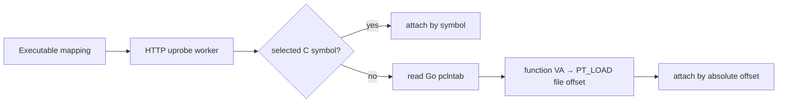
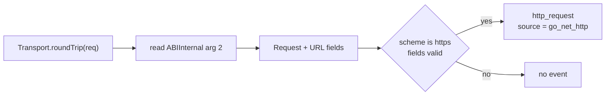

# Go net/http Uprobes

This page defines the Go-specific contracts used by the common
[HTTP uprobe runtime](http-uprobes.md). Discovery, worker ownership, target
limits, and reclaim are shared with OpenSSL and nghttp2 and are not repeated
here.

## Why Go needs a separate resolver

Release Go binaries are commonly statically linked and stripped with `-s -w`.
Their `.symtab` and `.dynsym` therefore cannot resolve Go functions for a normal
symbol-based uprobe attach. Go retains pclntab data for runtime symbolization,
so KernelIO resolves one selected function from that metadata and attaches by
ELF file offset. The original runtime table design is described in
[Go 1.2 Runtime Symbol Information](https://golang.org/s/go12symtab).

Go's runtime metadata is not a stable symbol-resolution API. Resolving one
function correctly requires release-specific knowledge, for example:

- Go 1.18 changed pclntab function entries to offsets relative to
  `runtime.text`;
- Go 1.20 changed the pclntab header magic and layout;
- external linking and cgo can place pclntab data inside read-only data instead
  of a named `.gopclntab` section;
- Go 1.26 sets the pclntab `textStart` field to zero and records the text base in
  `.go.module`.

Maintaining and validating those layouts in cicd-sensor would require ongoing
work for every Go release and would duplicate a security-sensitive ELF parser.
Address resolution therefore uses
[opentelemetry-ebpf-profiler](https://github.com/open-telemetry/opentelemetry-ebpf-profiler),
which already tracks these layouts for profiling stripped Go binaries.

The resolver integration is implemented in
[`go_http_symbols.go`](https://github.com/cicd-sensor/cicd-sensor/blob/main/internal/agent/kerneltracker/kernelio/go_http_symbols.go).
The dependency returns a function virtual address. cicd-sensor still selects
the function, converts the address to an executable ELF file offset, validates
the Go ABI and object-field contract, and owns the resulting uprobe link.
Dependency updates must pass the supported-version and real-client tests before
merge.



## Capture point

The selected function is:

```text
net/http.(*Transport).roundTrip
```

It is the shared implementation used before HTTP/1 serialization or HTTP/2
HPACK, so one hook covers both protocol paths used by the standard
`net/http.Transport`. It records an attempted request; it does not prove that
the request was delivered.



The BPF program reads only:

- `Request.Method`, using `GET` when empty;
- `Request.URL`;
- `Request.Host`, falling back to `URL.Host`;
- `URL.Scheme`, which must be `https`;
- `URL.Path`, using `/` when empty.

It does not read `RawQuery`, `RawPath`, headers, cookies, request bodies, or TLS
buffers. `URL.Path` is the decoded logical path, so its spelling can differ from
the escaped path sent on the wire.

## Go runtime contracts

Go's ABIInternal and object layout are implementation details. The current
implementation supports Go 1.18 through 1.27 with the tested 64-bit layouts on
Linux amd64 and arm64; it does not infer a Go version at runtime.

Only the register-based [ABIInternal](https://go.dev/s/regabi) is supported.
Go introduced this calling convention on Linux amd64 in
[Go 1.17](https://go.dev/doc/go1.17#compiler) and extended it to arm64 in
[Go 1.18](https://go.dev/doc/go1.18#compiler). The older stack-based calling
convention is not supported. ABIInternal can change between Go versions, so
these introduction versions do not imply automatic compatibility with every
later release.

For `Transport.roundTrip(t, req)`, the request pointer is the second integer
argument:

| Architecture | Receiver | `*http.Request` |
| --- | --- | --- |
| amd64 | `RAX` | `RBX` |
| arm64 | `R0` | `R1` |

The BPF reader uses these field offsets:

| Field | Offset |
| --- | ---: |
| `http.Request.Method` | 0 |
| `http.Request.URL` | 16 |
| `http.Request.Host` | 128 |
| `url.URL.Scheme` | 0 |
| `url.URL.Host` | 40 |
| `url.URL.Path` | 56 |

The implementation validates pointers, lengths, the HTTPS scheme, and field
bytes before reserving an event. An unsupported layout should normally produce
no event, but these checks are not a formal compatibility guarantee for a
future Go release. Offset tests must be updated together with any supported Go
range change.

Address resolution and request decoding are separate compatibility contracts.
The profiler dependency handles Go metadata layout differences. cicd-sensor
still owns the ABI registers and `http.Request` / `url.URL` field offsets above.
A new Go release must pass both address-resolution and real-request tests before
the documented range is advanced.

## Resolution and link lifetime

KernelIO asks the profiler resolver for the selected function's virtual
address, then converts that address through the containing executable
`PT_LOAD` segment:

```text
file offset = function VA - segment virtual address + segment file offset
```

The worker then calls cilium/ebpf with an empty symbol and
`UprobeOptions.Address` set to that absolute file offset. The resulting link is
stored in the existing inode-keyed `attachedTargets` registry and follows the
same maps-liveness reclaim as every other HTTP uprobe.

No Go-specific worker, queue, registry, target cap, or reclaim path exists.

## Known limits

- Custom `RoundTripper` implementations that bypass `net/http.Transport` are
  not captured.
- Raw `crypto/tls`, HTTP/3/QUIC, response reads, and Go's pre-register stack ABI
  are not supported.
- Binaries whose retained Go metadata is not supported by the pinned profiler
  dependency are not captured.
- Classification and attachment use the common bounded-stop lifecycle. Timeout
  or stop-establishment failure can still resume execution before attachment;
  see [Stop safety and recovery](http-uprobes.md#stop-safety-and-recovery).
- Retries and redirects can produce more than one request event.
- A request attempt can be emitted even if transport validation or network
  delivery later fails.

## Verification

Unit tests build stripped non-PIE, PIE, and cgo externally linked PIE clients,
resolve `Transport.roundTrip` through the profiler dependency, validate the ELF
file-offset conversion, and verify the fixed Request/URL offsets. BPF
integration tests exercise both `http.Client.Do` and direct
`Transport.RoundTrip` over HTTP/1.1 and HTTP/2, including a fresh-process
first-request case. A dedicated Ubuntu 24.04 matrix uses stripped internally
and externally linked fixtures built with Go 1.18.10, 1.20.14, 1.26.7, and
1.27.0 on amd64 and arm64. Real-client coverage includes the `gh` binary.
