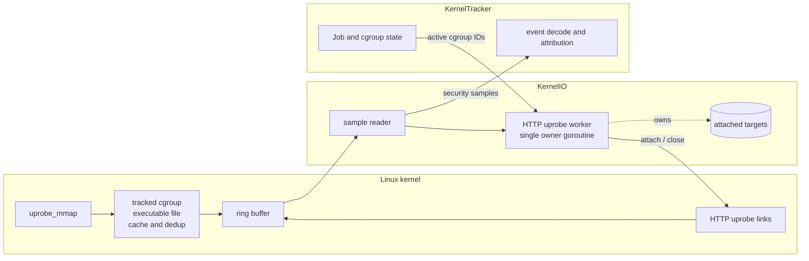
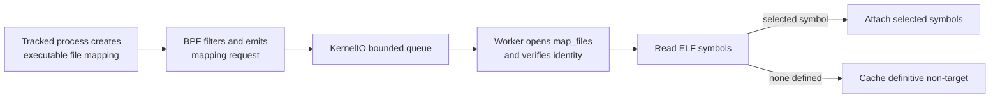
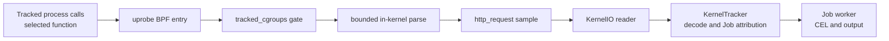
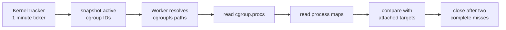

# HTTP Uprobe Runtime

cicd-sensor uses uprobes to observe an HTTP request while it is still plaintext
inside a userspace library. The runtime currently supports OpenSSL HTTP/1.x and
nghttp2 HTTP/2. Both taps are implemented but remain disabled by default while
first-request timing and environment compatibility are evaluated.

Coverage follows the library function that a workload calls. It does not follow
the executable name or programming language. This page describes the
HTTP-specific part of the [eBPF Runtime](../ebpf-runtime.md).

## Design goals

HTTP uprobe discovery follows five priorities, in order:

1. **Discover early.** Start attachment at the earliest stable point where the
   kernel has created an executable file mapping. Do not wait for a network
   connection or periodic scan.
2. **Filter in eBPF.** Use kernel-known facts to reject out-of-scope cgroups,
   non-executable mappings, known non-target files, and duplicate observations
   before they reach userspace.
3. **Keep complex work in userspace.** ELF parsing and uprobe attachment require
   userspace libraries and file access. eBPF identifies a candidate; it does not
   parse ELF files or own links.
4. **Preserve ownership boundaries.** One KernelIO worker owns classification,
   links, and reclaim. KernelTracker continues to own Jobs and cgroups.
5. **Bound failure.** Discovery must not block security-event intake, and reclaim
   must not detach a target when liveness is uncertain.

These goals explain the trigger, filtering, worker, and reclaim design below.

## Why executable mappings are the trigger

An uprobe attaches a BPF program to a function offset in a specific ELF file.
The Agent cannot attach one generic probe to every future copy of `SSL_write` or
`nghttp2_submit_request`; it must first find the mapped file, inspect its
symbols, and attach to the matching offsets.

Discovery must happen after a Job is tracked and before the selected function is
called. The trigger must also cover libraries loaded after process startup.

| Candidate trigger | Decision | Reason |
| --- | --- | --- |
| TCP connect | Rejected | The first TLS write can immediately follow connect, leaving too little time to scan every process mapping and attach. |
| process exec | Rejected as the primary trigger | It requires a full-process scan and does not detect a library loaded later with `dlopen`. |
| periodic process scan | Rejected for attach | It delays attachment by the scan interval and repeats work. Periodic scanning is retained only for reclaim. |
| `mmap` syscall tracepoint | Rejected | Discovery needs the completed VMA and its backing file, not only syscall arguments. |
| `fentry/uprobe_mmap` | Selected | It runs after an executable file-backed VMA exists and exposes enough kernel state to filter by cgroup, mapping type, and file identity before userspace work. |

The selected hook is an early notification, not a blocking attachment point.
ELF parsing and uprobe attachment still happen asynchronously in userspace, so
the first call can race ahead of attachment. Isolated fresh-process tests
captured curl 4/10 times and Python `urllib.request` 10/10 times on arm64 Ubuntu
24.04 with Linux 6.8; steady-state capture passes. This is a rollout gate, not a
guarantee hidden by the design.

## Runtime design

The HTTP uprobe worker is part of KernelIO. One goroutine owns classification,
attachments, and reclaim. KernelTracker owns Jobs and tracked cgroups; the
worker receives only immutable active-cgroup IDs for reclaim.

The runtime has four important objects:

| Object | Identity and contents | Owner |
| --- | --- | --- |
| mapping request | process, VMA range, device, inode, and ctime | BPF creates it; the worker consumes it |
| attached target | one device/inode and all links attached to its selected symbols | HTTP uprobe worker |
| uprobe link | one target symbol attachment; `Close` detaches it | HTTP uprobe worker |
| non-target cache | files definitively shown to define none of the selected symbols | bounded BPF LRU map; worker writes results |

An attachment belongs to a mapped file, not to one PID or Job. A process outside
a tracked Job can therefore reach the same attached function. Every HTTP uprobe
BPF entry checks `tracked_cgroups` before parsing or emitting an event.

### Attach path

The BPF hook discards non-executable and anonymous mappings, mappings outside a
tracked cgroup, known non-target files, and duplicate observations of the same
file in one process. One ELF can have several executable VMAs, so dedup uses the
process lifetime plus file identity instead of the VMA range.

The mapping request is KernelIO control input. The sample reader queues it
directly to the worker; it does not enter KernelTracker, Job attribution, or CEL
evaluation. The queue is non-blocking so ELF work cannot stop ring-buffer
intake.

The worker opens `/proc/<pid>/map_files/<range>` and verifies that `fstat`
returns the device, inode, and ctime from the kernel sample. A VMA can merge
before the open, so an `ENOENT` gets one current `/proc/<pid>/maps` lookup for
the same device/inode. Any identity mismatch is treated as a race: the worker
neither attaches nor caches the file.

The worker then reads `.symtab` and `.dynsym` and considers only selected symbols
defined by that ELF. An undefined import is not an attachment target. Outcomes
are intentionally conservative:

| Classification result | Action |
| --- | --- |
| target is already attached | Keep the existing links. |
| at least one selected symbol is defined | Attach those symbols and store their links as one target. |
| all selected symbols are definitively absent | Add the file classification key to the non-target cache. |
| permission, I/O, identity, or attach failure | Store nothing so a later mapping can retry. |

### Event path

Attaching a link does not emit an event. A later call to the attached function
starts the data path:

The kernel emits only the fields required by `http_request`:

| Field | Value |
| --- | --- |
| `method` | Request method, normalized to lowercase for rule evaluation. |
| `path` | Request path with the query removed in BPF, then normalized to lowercase. |
| `host` | HTTP/1.x `Host` or HTTP/2 `:authority`, normalized to lowercase; a port can remain. |
| `source` | Capture path: `openssl` or `nghttp2`. |
| `process` | KernelTracker's process snapshot for the caller. |

Raw request bytes, query parameters, other headers, and bodies do not cross the
kernel boundary. This is the redaction invariant. The path is still useful
because it distinguishes APIs on the same host, which `network_connect` alone
cannot do.

### Reclaim path

The kernel does not remove an uprobe link when one process exits or one
container is deleted. The same mapped file can also be shared by several Jobs.
Link lifetime therefore follows observed mappings across all tracked cgroups,
not one PID or Job.

For each attached target, the worker stores only a consecutive complete-miss
count:

| Reconcile observation | Action |
| --- | --- |
| mapped by any tracked process | Reset the miss count to zero. |
| absent from a complete scan | Increment the miss count; close at two. |
| possibly hidden by any read or walk failure | Keep the links and leave the count unchanged. |

The active-cgroup snapshot, process mappings, and mapping notifications are not
atomic. A target attached after the snapshot can be absent from that scan even
though it is live. Requiring a second complete miss prevents this one-scan race
from closing a fresh link. Incomplete scans are fail-keep because they cannot
prove absence. Reclaim observes liveness and closes links; it never classifies
or attaches files.

### Bounds and failure direction

| Resource or failure | Contract |
| --- | --- |
| non-target cache | 65,536-entry BPF LRU, keyed by device, inode, and ctime. Eviction causes reclassification, not lost coverage. |
| process/file dedup | 16,384-entry BPF LRU, keyed by process start time, TGID, and file classification key. Eviction can repeat a mapping notification. |
| userspace mapping queue | 4,096 entries, non-blocking. Overflow drops that request; a later process mapping the file can retry. |
| attached targets | 4,096 maximum. The worker refuses a new target and never evicts a live one; reclaim must free capacity. |
| shutdown | The worker closes every remaining link. |

One goroutine serializes attach, cache update, reconcile, and close. No other
goroutine reads or mutates attached-target state, so this lifecycle needs no
mutex.

## Coverage

A function is selected only when it exposes method, path, and host before
encryption or protocol encoding, has an argument ABI that the BPF program can
parse, and can be resolved from the mapped ELF. Real-client E2E tests establish
client coverage; an executable name alone does not.

### Selected functions

| Function | Status | Capture point | Verification |
| --- | --- | --- | --- |
| [`SSL_write`](https://docs.openssl.org/master/man3/SSL_write/) | Implemented; rollout disabled | OpenSSL HTTP/1.x plaintext buffer in arguments 2 and 3. | curl, Node, npm, and wget HTTP/1.x E2E |
| [`SSL_write_ex`](https://docs.openssl.org/master/man3/SSL_write/) | Implemented; rollout disabled | Same input buffer contract used by the observed Python path. | `urllib.request`, requests, and pip E2E |
| [`nghttp2_submit_request`](https://nghttp2.org/documentation/nghttp2_submit_request.html) | Implemented; rollout disabled | HTTP/2 pseudo-headers before HPACK; `nva` is argument 3 and `nvlen` is argument 4. | curl, Node, and Git HTTP/2 E2E |
| [`nghttp2_submit_request2`](https://nghttp2.org/documentation/nghttp2_submit_request2.html) | Implemented; rollout disabled | Same relevant argument positions. | Attach integration; a client can select either nghttp2 API |

Selected symbols with the same argument and parsing contract share one BPF
entry.

### Workload status

Verified rows have a reproducible real-client E2E on GitHub-hosted Ubuntu
22.04, 24.04, and 26.04 preview on x64 and arm64 unless noted otherwise.
`Not covered (verified)` means the E2E confirmed that the runner image does not
call a selected function.

| Workload | Status | Observed path |
| --- | --- | --- |
| curl over HTTPS HTTP/1.1 | Verified | `SSL_write` |
| Python `urllib.request`, requests, and pip over HTTPS HTTP/1.x | Verified | `SSL_write_ex` |
| Node and npm over HTTPS HTTP/1.x | Verified | `SSL_write` |
| wget over HTTPS HTTP/1.x | Verified on 22.04 and 24.04 | `SSL_write`; Ubuntu 26.04 preview uses GnuTLS and is not covered. |
| Git over HTTPS HTTP/1.x | Not covered (verified) | GitHub-hosted Ubuntu uses a GnuTLS-backed Git HTTP helper. |
| curl and Node over HTTPS HTTP/2 | Verified | selected nghttp2 request API |
| Git over HTTPS HTTP/2 | Verified | selected nghttp2 request API for default negotiation and explicit `http.version=HTTP/2` |
| Go, Java, or rustls-based HTTPS | Not covered | Does not call a selected function. |
| Python `h2` / httpx HTTP/2 | Not covered | Does not use nghttp2 for request submission. |

## Known limits

- Discovery sees executable file mappings created while the process is already
  in a tracked cgroup. It does not catch up pre-existing mappings, processes
  moved into a tracked cgroup, or mappings made executable only by a later
  `mprotect(PROT_EXEC)`.
- Userspace classification and attach are asynchronous. The first selected
  function call can race ahead of attachment; rollout remains disabled by
  default until this gate is resolved.
- A full mapping queue has no same-process retry guarantee. The next process
  generation mapping the same file can retry.
- Only functions resolvable from `.symtab` or `.dynsym` are selected. A stripped
  static binary without the selected symbol is not captured.
- HTTP/1.x parsing starts at one write boundary. Split request lines or a `Host`
  outside the bounded prefix can be missed.
- HTTP/2 is visible only before HPACK in a selected nghttp2 API. Other HTTP/2
  implementations and HTTP/3/QUIC are not parsed.
- The nghttp2 parser examines at most 32 pseudo-headers and requires `:method`
  and an origin-form `:path`. Standard CONNECT has no `:path` and is not
  emitted; extended CONNECT can be emitted but `:protocol` is not exposed.
- The nghttp2 tap drops methods longer than 15 bytes and paths longer than 255
  bytes. A missing, invalid, or oversized `:authority` produces an empty host.
- Retries can produce duplicate events. Capture is not exactly once.
- Absence of `http_request` is not proof that no egress occurred. Rules should
  retain `network_connect` coverage; `domain` can also be absent when name
  resolution uses an encrypted path such as DNS over HTTPS.
