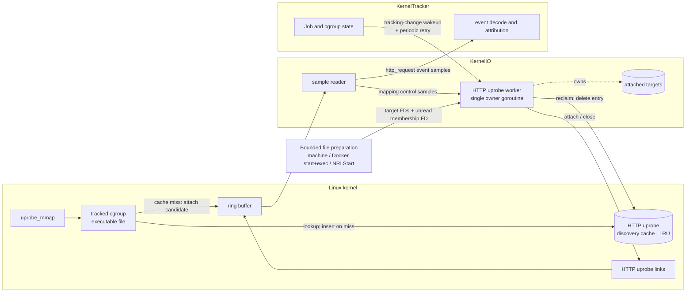
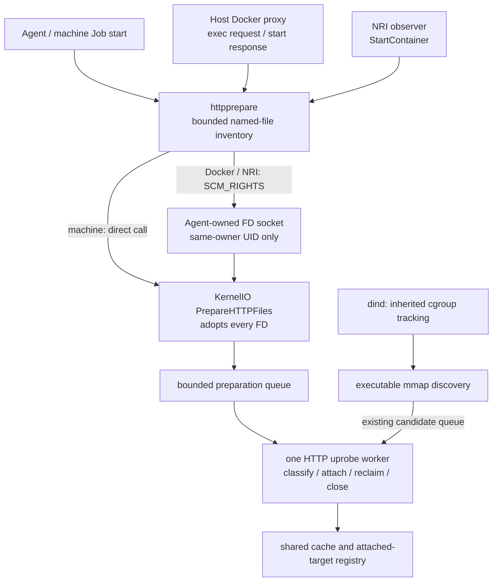
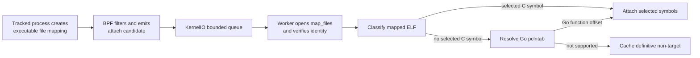
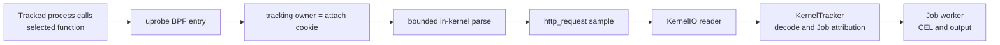
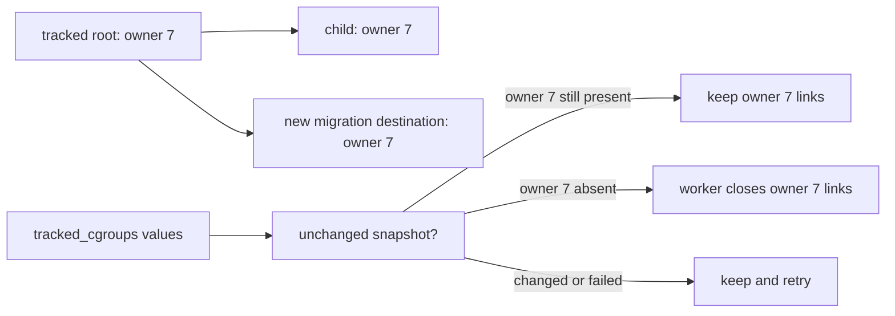

# HTTP Uprobe Runtime

This chapter defines the userspace-library HTTP capture runtime: why it exists,
how it discovers and attaches uprobes, how requests become events, and how
attachments are reclaimed. Cleartext HTTP capture at `tcp_sendmsg` uses the same
`http_request` event but does not use this discovery lifecycle.

Cleartext HTTP, OpenSSL HTTP/1.x, nghttp2 HTTP/2, and Go `net/http` HTTPS
capture are implemented. All `http_request` sources remain disabled by default
while first-request timing and environment compatibility are evaluated. Enable
them together with `--enable-http-request=true`.

## Reading this implementation

A uprobe observes calls to a function in a userspace program. Attaching means
registering that observation; the retained link lets the worker remove it later.
OpenSSL and nghttp2 are usually separate shared-library files, while `gh` and
`glab` usually contain the relevant Go code in their executable. Preparation
therefore looks for `libssl.so` and `libssl.so.*` files, not the `openssl` command.

### Finding a container's files from its PID

A Linux container's programs are also processes on the node. A PID identifies a
process, and `/proc/PID/root` provides access to that process's filesystem view,
including its mounts, when permissions allow it. Here, root means the filesystem
root `/`, not the root user. For example, after opening `/proc/1234/root`, the
scanner can look inside `usr/lib` as process 1234 sees it. The PID supplies the
entry point; the scanner still needs the bounded directory and filename list.
See the Linux [`proc_pid_root(5)`](https://man7.org/linux/man-pages/man5/proc_pid_root.5.html) documentation.

PIDs can have different numbers in different PID namespaces. Docker inspect
reports the daemon's numbering, so `dockerProcessRoot` uses that daemon's `/proc`
view and checks it before interpreting the container PID. This avoids depending
on Docker's private storage-directory layout.

### Library directory names and links

Debian-style multiarch directories distinguish CPU/ABI-specific libraries:
`x86_64-linux-gnu` for amd64 and `aarch64-linux-gnu` for arm64 in this scanner.
These names are often called triplets; `architectureDirName` names their role in
`inventoryDirectories`. Selection follows the Agent's architecture, not a scan
of each container's executable architecture.

A normal symlink points to another pathname. A procfs magic link such as
`/proc/PID/fd/7` can instead refer directly to a file held by a process. Candidate
lookup rejects these with `RESOLVE_NO_MAGICLINKS` and keeps normal symlinks inside
the selected root with `RESOLVE_IN_ROOT`. This restriction applies *after* the
runtime-supplied `/proc/PID/root` entry point has been opened intentionally.

### Passing an opened file to the Agent

An FD is a process-local number for an opened file. Sending the number alone is
not enough: FD 7 in the observer can mean something different from FD 7 in the
Agent. `SCM_RIGHTS` asks Linux to give the receiving Agent its own FD for the file
already opened by the sender. The Agent might receive FD 12; closing the sender's
FD 7 does not close the Agent's FD 12. No file contents need to be copied.

This keeps the opened target available across processes. The worker additionally
checks the actual backing file used by Linux, because an overlay filesystem can
present a different visible identity. The identity checks below handle this
separately from the FD transfer.

## Purpose and scope

Network destination alone is not always enough to identify a malicious action.
An upload to `github.com`, for example, can use a legitimate domain while sending
credentials or artifacts to an attacker-controlled repository. A `domain` event
can also be absent when a process resolves names through DNS over HTTPS, leaving
`network_connect` with only an IP address.

`http_request` adds method, query-stripped path, host, capture source, and process
identity. These fields create more detection and investigation points for
operations that otherwise share the same destination.

There is no universal capture point for every HTTP request. TLS and HTTP
implementations expose plaintext at different functions, some binaries do not
retain attachable symbols, and HTTP/2 or HTTP/3 can encode a request before a
generic write function sees it. Complete coverage is therefore not a design
claim. The design does not treat avoidable capture gaps as acceptable: each
supported function path should attach as early as practical, and measured misses
should drive additional catch-up mechanisms when their benefit justifies the
cost.

`http_request` is a supplemental signal, not a complete egress record. Its
absence does not prove that no HTTP or network communication occurred.

## Architecture

HTTP uprobe discovery is part of the [eBPF Runtime](../ebpf-runtime.md). KernelIO
owns kernel-facing resources and one HTTP uprobe worker. KernelTracker owns Jobs,
tracked cgroups, process context, and event attribution.

For each executable file mapping, BPF checks the owner/file LRU cache and inserts a key on a
miss before emitting an attach candidate. Reclaim closes ended-owner links and removes their cache entries. Transient work failure and a
full worker queue also remove the entry so a later mapping can retry.

KernelTracker requests a periodic reclaim check. KernelIO also wakes the worker
on cgroup removal and tracked-map deletion; the worker reads the kernel tracking
map itself, so child inheritance need not wait for userspace notification. Lifecycle adapters separately request preparation
of a small predefined inventory. They own no classification or uprobe links.

The worker serializes preparation, attach candidates, and reconciliation on one
goroutine. No other goroutine reads or mutates its attached-target state, so
classification, attach, and close do not require a mutex. KernelIO separately
serializes loop startup and teardown so closing the Agent cannot race goroutine
registration. Starts after close and duplicate starts are rejected.

### Preparation entry points and ownership

Preparation registers probes on existing files before a later function call.
It does not require the target program to be running, but it does require access
to the actual file that the workload will map. A host copy of an image library
is not a substitute for the container's file.

| Environment | Preparation window | Files available at that window | Remaining gap |
| --- | --- | --- | --- |
| Machine | Successful Job start | Fixed host inventory | Files installed later or outside that inventory |
| Host Docker through the proxy | Before forwarding a later exec start | Files in the already-running container's root | Initial entrypoint; files created by the exec itself |
| GitLab Docker executor through the proxy | After dockerd starts the container, before returning success to Runner | Files in the running container's root | Entrypoint code already runs; only scripts sent after the response benefit |
| containerd CRI/runc with NRI | `StartContainer`, before task start | Waiting init process's root | Later exec has no NRI preparation callback |
| dind inner workloads | No inner-daemon preparation | Discovered through tracked executable mappings | Initial calls may precede attachment; host proxy/NRI cannot see inner lifecycle requests |

The inventory opens files; the worker interprets them. Runtime adapters select
the root and timing but do not parse ELF, store links, or create Job state.
Local inventory and the FD receiver use the same `FileHandler` contract: calling
the handler transfers responsibility for every target and membership FD.
The FD socket is owned by Agent and is never mounted into Jobs. KernelTracker's
preparation method forwards to KernelIO without entering the event reactor.

| Read in this order | Responsibility |
| --- | --- |
| `internal/agent/httpprepare/preparation.go`, `inventory_linux.go` | Bound filesystem work; open only known names below the selected root |
| `internal/agent/httpprepare/transport_linux.go` | Authenticate node-side producers; transfer and release exact FDs |
| `internal/agent/kerneltracker/kernelio/http_preparation_linux.go` | Adopt requests; share classification, cache, and attachment with mapping discovery |
| `internal/agent/kerneltracker/kernelio/http_uprobe_control_linux.go` | Confirm backing identities before parsing and after registration |
| `internal/agent/kerneltracker/kernelio/http_uprobe_worker.go` | Serialize work and reclaim targets |

### Retained runtime state

| Type | State | Purpose and identity | Access | Bound and removal |
| --- | --- | --- | --- | --- |
| Worker-owned registry | `attachedTargets` (`attachedUprobeTarget` entries) | Keyed by tracking owner and backing `mappedFileIdentity` (device, inode); stores classification key and links | HTTP uprobe worker only | 4,096 owner/file targets; reclaimed after the last owner member leaves tracking |
| Shared BPF cache | `http_uprobe_discovery_cache` | Keyed by owner and `fileClassificationKey` (device, inode, ctime); suppresses callbacks for files already queued, classified, or attached | BPF hook, KernelIO reader, and worker | 65,536-entry LRU; failed work and reclaim remove entries |

The cache is notification suppression, not the link registry. Eviction can cause
another classification, but it cannot detach or lose a link. `attachedTargets`
remains the source of truth for attached links.

A kernel uprobe observes a file and offset across processes. Each retained link
here additionally carries its tracking owner as an attach cookie. Every HTTP
uprobe BPF entry compares that cookie with the calling cgroup's owner before
parsing or emitting an event.

## Discovery and attachment

### Discovery model

Mapping notification is the primary discovery path. It reacts when a process in
a tracked cgroup receives a new executable file mapping, before the selected
library function is called.

This also covers mappings created by later Jobs and containers on long-lived
self-hosted or Kubernetes runners, provided their cgroup is already tracked.
ELF inspection and attachment still run asynchronously in userspace, so the
selected function can run first and the initial request can be missed.

Each candidate carries a `fileClassificationKey` made from backing device,
inode, and ctime. Ctime is a generation hint, not a guarantee against concurrent
in-place modification. Overlay-visible `fstat` identities are not canonical.

Bounded preparation improves the first-request window for known common files.
All other files keep using mapping discovery. There is no open/write trigger,
periodic attach scan, recursive workspace scan, or image/snapshot parser.

### Bounded preparation

| Target | Resolution | Inventory below the selected root |
| --- | --- | --- |
| `libssl.so`, `libssl.so.*` | Defined ELF function symbols | `/lib`, `/lib64`, `/usr/lib`, `/usr/lib64`, `/usr/local/lib`, `/usr/local/lib64`, and the host architecture's `/lib` and `/usr/lib` multiarch directories |
| `libnghttp2.so`, `libnghttp2.so.*` | Defined ELF function symbols | Same library directories |
| `gh`, `glab` | Go pclntab | `/bin`, `/usr/bin`, `/usr/local/bin` |

Successful machine Job-start requests refresh the bounded host inventory.
Agent startup does not scan. Runtime PATH, command and tool-cache metadata are
not inspected; binaries elsewhere remain mapping-discovered.
Docker proxy preparation runs before forwarding a later `/exec/{id}/start`,
and, for GitLab only, after a successful `/containers/{id}/start` response arrives from dockerd,
before returning that response to the caller. At the latter point the container
is already running and its PID/root can be inspected. GitLab Runner's ordinary
Docker executor sends shell stdin only after `ContainerStart` returns, so this
prepares known files before that script. It does not stop an entrypoint that
runs independently of stdin. Existing container-create cgroup staging is unchanged.
GitHub job-container steps normally use Docker exec; Docker container actions
and service entrypoints do not wait for an exec gate.
Both paths share container inspect, the daemon's verified PID/procfs view, and
the same FD preparation API. No script/stream parsing or buffering is added. Containers bypassing the proxy
remain mapping-discovered. The proxy requires the existing systemd cgroup driver and stages `docker-ID.scope`.
The daemon must be local to the proxy; TCP-only remote Docker endpoints do not
expose a verifiable process root. dind inner workloads use existing
cgroup propagation and mmap discovery only. The host Docker proxy does not see
inner daemon API requests. Inner-proxy deployment and inner-workload
pre-attachment are outside the supported preparation paths.

The NRI observer prepares known CI containers at `StartContainer`, using the
waiting init PID's root. On the supported containerd CRI/runc path, this callback
is between task creation and task start. It does not imply notifications for
later exec operations. Reconnect does not prepare existing containers or replay
missed Job staging. Mapping discovery observes future executable mappings; it
does not replay files already mapped before an Agent restart.
It also requires an actively tracked cgroup: restarting the Agent does not
restore existing Job tracking, so future mappings alone cannot recover those
Jobs. New containers staged after restart use the normal preparation path.

Inventory uses `openat2(RESOLVE_IN_ROOT | RESOLVE_NO_MAGICLINKS)` so absolute
container symlinks resolve inside the selected root, including library directory
symlinks. Executables use six fixed path probes. In each of at most eight library
directories, inventory matches the patterns above against at most 4,096 names
without recursion. It reads one extra name to detect overflow, then opens only
matching candidates. This is a resource bound, not a measured optimum; files
beyond the limit can miss preparation because directory order is unspecified.
It retains at most 32 FDs. Custom paths, excess entries and late-installed files use
mapping discovery. Prepared files remain attached for their cgroup tracking
lifetime, including a delayed first use. There is no preparation grace timer.

All producers call `PrepareHTTPFiles`; the API adopts every FD, including on
rejection, and returns only an error; per-batch counts remain worker diagnostics.
NRI and Docker use an Agent-owned Unix packet socket at
`<agent-socket>.http-preparation`, mode `0600`, with same-owner `SO_PEERCRED`
validation and `SCM_RIGHTS` transfer. Keep this socket node-side, outside Job
mounts. It is separate from the runner-facing HTTP routes. Received ancillary
data determines the FD count; empty or truncated transfers are rejected. The
wire uses version byte 1, an unread `/proc/PID/cgroup` FD first, then target
FDs, and a one-byte reply (0: complete, 1: incomplete);
source labels remain in producer logs. The Agent reads membership in its node
cgroup namespace and resolves the ID against its configured cgroup mount.
The NRI observer needs no additional cgroup mount or namespace-changing privilege.
The membership FD pins the process identity; it does not freeze its membership.
An exited process or an untracked cgroup fails preparation open. Agent and node-side producers use the
same protocol version. A mismatched packet fails open. The receiver uses its own 500 ms deadline
from connection acceptance, including the time waiting for descriptors. The
caller has its own 500 ms total wait; an earlier caller cancellation need not
immediately cancel already-adopted work.

The 500 ms deadline covers root resolution, inventory, transfer, queueing, classification, and
attachment waiting. Workloads continue on timeout, queue saturation, missing
files, or attach failure. A filesystem syscall or link close can outlive that
wait; bounded producer slots and worker ownership retain responsibility for
cleanup. Preparation has an eight-request queue and eight producer slots per
Preparation instance, plus eight receiver connections per Agent. Docker inspect
and root acquisition run inside the same producer slot as inventory. These are
resource budgets, not measured optimal concurrency or a node-wide eight-job
limit. Each 32-FD batch gives at most 256 queued target FDs and 32 active target
FDs at the worker; each admitted call also retains at most one membership FD.
Producer/SCM_RIGHTS copies and link FDs are additional.
Canceled callers cannot free admission while their actual work is still blocked.
The 500 ms budget bounds waiting; it is not an I/O cancellation guarantee. Saturation fails open instead of
adding workers or an unbounded wait queue. Existing mapping cap 4096 remains.

Normal mapping samples and event delivery keep their existing queues. Mapping
discovery and reconciliation are serviced between preparation batches. Between target closes it yields to pending
preparation or mapping work; an idle sweep drains eligible targets. Individual
close latency is measured because kernel unregister cannot be preempted.

### Backing identity

The existing `uprobe_mmap` hook reports the backing identity of a temporary
one-page read-only mapping made by the worker. ELF and Go resolvers use normal
FD reads. After attaching selected offsets, the worker reopens `/proc/self/fd/FD`
and normalizes again. A copy-up, replacement, or changed generation rejects the
result and closes provisional links. The mapping is never read by userspace.

Both discovery paths use the same worker, owner/file cache, and owner/inode
registry. A completed negative classification differs from a queued notification.
Before work and before committing a result, the worker checks that the cgroup
still has the owner captured at queue admission. The owner is also the attach
cookie checked by each HTTP uprobe entry program. An end racing with the final
userspace check makes that cookie inactive immediately; reclaim closes any
remaining link later.

Reclaim no longer reads process maps or requires `show_map_vma`, visible-inode
aliases, or a separately loaded BPF control object. The existing mmap hook remains
necessary for file identity. If it cannot be attached, HTTP initialization follows
the existing loader error behavior; normalization is not an optional silent
fallback to visible overlay inode numbers.

These checks do not make concurrent file-content writes atomic. In particular,
a provisional link can execute before post-attachment validation rejects it.
Unusual concurrent mutations can therefore affect observation during that short
window. The invariant is that a mismatching result is not retained under the
wrong file key; it is not a universal race-free filesystem snapshot.

Primary lifecycle references: [Linux uprobes](https://github.com/torvalds/linux/blob/v6.8/kernel/events/uprobes.c),
[Linux proc maps](https://github.com/torvalds/linux/blob/v6.8/fs/proc/task_mmu.c),
[GitLab Runner start/STDIN ordering](https://gitlab.com/gitlab-org/gitlab-runner/-/blob/v18.10.1/executors/docker/internal/exec/exec.go),
and [containerd CRI start](https://github.com/containerd/containerd/blob/v2.2.0/internal/cri/server/container_start.go).

Mapping notification is also not limited to dynamically linked libraries. A
statically linked executable, including a Go binary, creates executable file
mappings when it starts. The same discovery trigger therefore feeds both ELF
symbol lookup and the Go-specific pclntab resolver.

The implemented attach path is:

### Kernel-side candidate filtering

`fentry/uprobe_mmap` receives a completed VMA and its backing file. The BPF
program emits an attach candidate only when all of these conditions hold:

- the VMA is executable and file-backed;
- the current cgroup has a nonzero HTTP tracking owner;
- the file is not already queued, classified, or attached according to
  `http_uprobe_discovery_cache`.

One ELF can create several executable VMAs. Dedup therefore uses the owner/file key
above rather than the VMA range or process identity. Filtering and dedup stay in
BPF because the kernel already has these values and rejecting a candidate there
avoids a ring-buffer sample and userspace work.

The attach candidate contains discovery metadata only. It carries no HTTP bytes
or file content.

### Userspace classification and attach

The KernelIO sample reader recognizes an HTTP uprobe attach candidate and puts it
on a bounded, non-blocking worker queue. Attach candidates do not enter
KernelTracker, Job attribution, or CEL evaluation.

The worker handles each candidate serially:

1. Open the mapped file through `/proc/<pid>/map_files`, normalize its backing
   identity, and compare it with the sample. A changed backing is not cached.
2. Look for selected C functions in `.symtab` and `.dynsym`. If none are
   defined, try the Go pclntab resolver described in
   [Go net/http Uprobes](go-http-uprobes.md).
3. Attach resolved file offsets, verify the registration backing, store their
   links as one attached target, and keep the discovery-cache entry.
4. If neither resolver finds a supported function, keep the cache entry.
5. On a transient failure or queue drop, remove the cache entry so a later
   mapping can retry.

## Event capture and delivery

Attachment prepares a capture point; it does not emit an event. A later call to
an attached function enters the existing security-event path.

### Capture points

| Function | Protocol path | Input contract | Source |
| --- | --- | --- | --- |
| [`SSL_write`](https://docs.openssl.org/master/man3/SSL_write/) | OpenSSL HTTP/1.x | plaintext buffer is argument 2; length is argument 3 | `openssl` |
| [`SSL_write_ex`](https://docs.openssl.org/master/man3/SSL_write/) | OpenSSL HTTP/1.x | same input-buffer argument positions | `openssl` |
| [`nghttp2_submit_request`](https://nghttp2.org/documentation/nghttp2_submit_request.html) | nghttp2 HTTP/2 | `nghttp2_nv` array is argument 3; count is argument 4 | `nghttp2` |
| [`nghttp2_submit_request2`](https://nghttp2.org/documentation/nghttp2_submit_request2.html) | nghttp2 HTTP/2 | same relevant argument positions | `nghttp2` |
| [`net/http.(*Transport).roundTrip`](go-http-uprobes.md) | Go `net/http` HTTPS, HTTP/1.x and HTTP/2 | pclntab resolves the function; a recognized stack check selects the capture point before ABIInternal argument 2 changes | `go_net_http` |

Selected functions with the same argument and parsing contract share one BPF
entry.

The OpenSSL path reads an HTTP/1.x request line and `Host` before encryption.
The nghttp2 path reads `:method`, `:path`, and `:authority` before HPACK encoding.
The Go path reads `http.Request` and `url.URL` before protocol encoding. All
produce the same event shape.

### Event and redaction contract

| Field | Value |
| --- | --- |
| `method` | request method, normalized to lowercase for rule evaluation |
| `path` | origin-form request path, with query excluded by the BPF capture, then normalized to lowercase |
| `host` | HTTP/1.x `Host`, HTTP/2 `:authority`, or Go `Request.Host` / `URL.Host`, normalized to lowercase; a port can remain |
| `source` | `openssl`, `nghttp2`, or `go_net_http` |
| `process` | KernelTracker process snapshot for the caller |

Raw request bytes, query parameters, other headers, and bodies do not cross the
kernel boundary. This is the redaction invariant.

## Link lifetime and reclaim

A tracking owner is a number for one cgroup family, not a container ID or a Job's
rule scope. KernelIO allocates a fresh nonzero number when directly binding or
staging a new root. Child cgroups and newly tracked migration destinations inherit
it in BPF. Existing destinations retain their own owner. Rebinding after removal
allocates another number, so delayed work cannot reactivate the old cookie.

`cgroup_rmdir` sets its value to zero before emitting the event, so a dropped
notification cannot leave its HTTP cookie active. The map entry remains for the
existing late-event attribution grace. Job finalization and normal cgroup purge
remove tracked-map entries through KernelIO. A target remains retained while any
member still holds its owner, including children and propagated migration targets.

One shared image file may have links for owners A and B. Closing A's own links
does not close B's registration. Both BPF entries can run on a call, but only the
entry whose cookie matches the calling cgroup parses it. The worker prevents
same-owner/inode duplicates. No URL, time-window, or last-event cache discards
legitimate repeated requests. Shared-file dispatch overhead still grows with the
number of registrations.

The worker reclaims only a coherent tracking-map snapshot. A userspace update
generation detects overlapping KernelIO map writes without making the tracking
reactor wait behind the scan. BPF brackets inheritance/removal
with an in-flight writer count and sequence; scans with active writers or changed
sequence fail-keep. The bracket starts before reading an inherited owner. This
prevents a disappearing source from hiding a newly created destination.
Numbers are never intentionally reused during the loaded object's lifetime.

| State | Action |
| --- | --- |
| At least one member retains the owner | Keep all its targets, even if not yet mapped. |
| Last member has ended in a coherent scan | Close that owner's links and delete its cache entries, including negatives. |
| Snapshot failed or changed | Keep links and retry on a later wakeup or periodic tick. |
| Preparation/candidate queue has work | Yield between target closes, retaining a reclaim wakeup. |
| Agent shutdown | The same worker closes remaining links after stopping admissions. |

There is no recursive cgroup walk or `/proc/maps` read for HTTP reclaim. A stale
mapping notification can still use a bounded maps-text lookup to find its merged
address range; the worker verifies the opened FD against the backing identity.
That lookup reads addresses, not the overlay-visible device/inode fields.
Discovery notifications and temporary normalization mappings use the same BPF
inode-key helper, so userspace does not need a second identity parser.
Long-running owners can retain more files than maps-liveness reclaim did; the
4,096-target cap remains, and cap saturation can reduce coverage.

Moving into an already independently tracked owner does not itself discover all
existing VMAs. That destination must have prepared or discovered the target;
future mappings remain the fallback. KernelTracker's existing notification-loss
and Job attribution limits also still apply to newly inherited cgroups.

## Coverage

Coverage is defined by an observed function path, not by a tool name. A client is
verified only when a reproducible real-client E2E produces the expected source
and request fields. `Not covered (verified)` means the same environment was
tested and did not call a selected function.

Verified rows below use GitHub-hosted Ubuntu 22.04, 24.04, and 26.04 preview on
x64 and arm64 unless noted otherwise.

| Workload | Status | Observed path |
| --- | --- | --- |
| curl over HTTPS HTTP/1.1 | Verified | `SSL_write` |
| Python `urllib.request`, requests, and pip over HTTPS HTTP/1.x | Verified | `SSL_write_ex` |
| Node and npm over HTTPS HTTP/1.x | Verified | `SSL_write` |
| wget over HTTPS HTTP/1.x | Verified on 22.04 and 24.04 | `SSL_write`; Ubuntu 26.04 preview uses GnuTLS and is not covered. |
| Git over HTTPS HTTP/1.x | Not covered (verified) | GitHub-hosted Ubuntu uses a GnuTLS-backed Git HTTP helper. |
| curl and Node over HTTPS HTTP/2 | Verified | selected nghttp2 request API |
| Git over HTTPS HTTP/2 | Verified | selected nghttp2 request API for default negotiation and explicit `http.version=HTTP/2` |
| GitHub CLI (`gh api`) | Verified | `net/http.(*Transport).roundTrip` |
| GitLab CLI (`glab`) | Verified in the Linux 6.8 arm64 fixture, real GitLab Docker jobs, and GKE COS amd64 runtime fixture | `net/http.(*Transport).roundTrip`; full ARC/GitLab Kubernetes deployment matrix pending. |
| Java or rustls-based HTTPS | Not covered | Does not call a currently selected function. |
| Python `h2` / httpx HTTP/2 | Not covered | Does not use nghttp2 for request submission. |

## Operational status and known limits

- `http_request` capture is disabled by default during rollout. The
  `--enable-http-request` switch controls both the cleartext tap and the HTTP
  uprobe runtime, and remains the disable path after default enablement.
- Mapping notification precedes the selected function call, but ELF
  classification and attachment are asynchronous. The function can run before
  its uprobe is attached, so the initial request can be missed. This remains a
  rollout gate.
- Preparation improves common existing files only. Workspace downloads,
  replacement after preparation, owner/target-cap saturation, and Docker
  initial entrypoints can still lose the first request. Dind inner workloads
  use mapping discovery only; inner-proxy preparation is outside the supported preparation paths.
- Discovery observes executable mappings created while the process is already in
  a tracked cgroup. Initial catch-up scanning, periodic attach backstop, moving an
  existing process into a tracked cgroup, and later `mprotect(PROT_EXEC)` are not
  current discovery paths.
- C library capture requires a selected function in `.symtab` or `.dynsym`.
  Go capture accepts only the pclntab layouts and ABI/object-layout range listed
  in [Go net/http Uprobes](go-http-uprobes.md).
- HTTP/1.x parsing starts at one write boundary. A split request line or `Host`
  outside the bounded prefix can be missed.
- HTTP/2 is visible only before HPACK in a selected nghttp2 API. Other HTTP/2
  implementations and HTTP/3/QUIC are not parsed.
- The nghttp2 parser examines at most 32 pseudo-headers and requires `:method`
  and an origin-form `:path`. Standard CONNECT has no `:path` and is not emitted;
  extended CONNECT can be emitted but `:protocol` is not exposed.
- The nghttp2 tap drops methods longer than 15 bytes and paths longer than 255
  bytes. A missing, invalid, or oversized `:authority` produces an empty host.
- Retries can produce duplicate events. Capture is not exactly once.

### Kernel implementation notes

Owner filtering uses `bpf_get_attach_cookie`, available on the Linux 5.15 baseline
for perf-event uprobes. See [Linux's helper dispatch](https://github.com/torvalds/linux/blob/v5.15/kernel/trace/bpf_trace.c)
and [cilium/ebpf's UprobeOptions](https://github.com/cilium/ebpf/blob/v0.20.0/link/uprobe.go).
A cookie is a userspace-assigned number, not a kernel pointer or a JobIdentity.
The three entry programs gate before reading HTTP fields; tail-call stages and
rule/event schemas are unchanged.

Tracking snapshots use one fixed-size array value and 64-bit BPF atomic updates.
Every early return from a cgroup hook passes through its wrapper's decrement.
The existing CO-RE cgroup and inode reads remain; no new kfunc, variable-length
kernel read, or unbounded BPF loop is introduced. The implementation needs its
own cookie gate because these HTTP programs parse directly from selected client
functions rather than using a generic tracing-policy dispatcher.

Reading a transferred membership FD in the Agent namespace follows
[`proc_cgroup_show`](https://github.com/torvalds/linux/blob/v6.8/kernel/cgroup/cgroup.c#L5869):
the path is rendered using the current reader's cgroup namespace. Producers must
leave it unread so seq_file does not buffer an earlier namespace's rendering.
