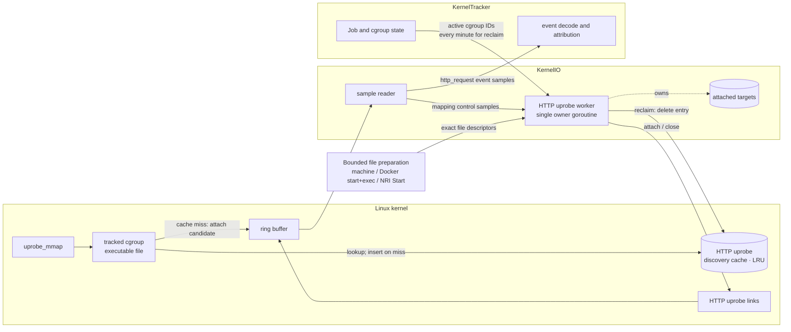
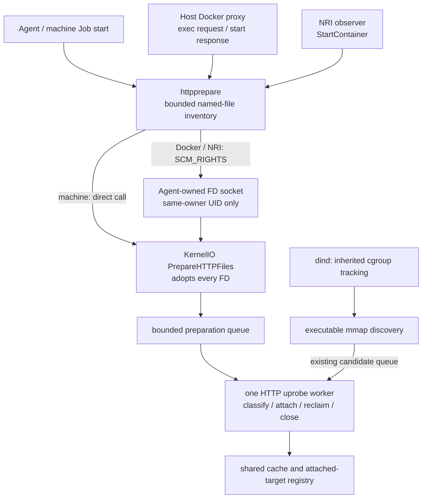
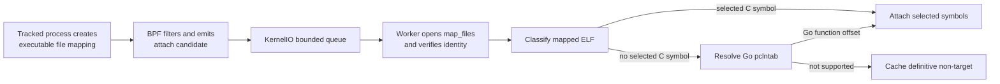
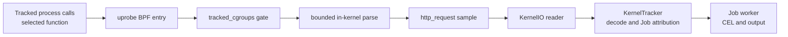

# HTTP Uprobe Runtime

This chapter defines the userspace-library HTTP capture runtime: why it exists,
how it discovers and attaches uprobes, how requests become events, and how
attachments are reclaimed. Cleartext HTTP capture at `tcp_sendmsg` uses the same
`http_request` event but does not use this discovery lifecycle.

Cleartext HTTP, OpenSSL HTTP/1.x, nghttp2 HTTP/2, and Go `net/http` HTTPS
capture are implemented. All `http_request` sources remain disabled by default
while first-request timing and environment compatibility are evaluated. Enable
them together with `--enable-http-request=true`.

## Purpose and scope

Network destination alone is not always enough to identify a malicious action.
An upload to `github.com`, for example, can use a legitimate domain while sending
credentials or artifacts to an attacker-controlled repository. A `domain` event
can also be absent when a process resolves names through DNS over HTTPS, leaving
`network_connect` with only an IP address.

`http_request` adds method, query-stripped path, host, capture source, and process
identity. These fields create more detection and investigation points for
operations that otherwise share the same destination.

There is no universal capture point for every HTTP request. TLS and HTTP
implementations expose plaintext at different functions, some binaries do not
retain attachable symbols, and HTTP/2 or HTTP/3 can encode a request before a
generic write function sees it. Complete coverage is therefore not a design
claim. The design does not treat avoidable capture gaps as acceptable: each
supported function path should attach as early as practical, and measured misses
should drive additional catch-up mechanisms when their benefit justifies the
cost.

`http_request` is a supplemental signal, not a complete egress record. Its
absence does not prove that no HTTP or network communication occurred.

## Architecture

HTTP uprobe discovery is part of the [eBPF Runtime](../ebpf-runtime.md). KernelIO
owns kernel-facing resources and one HTTP uprobe worker. KernelTracker owns Jobs,
tracked cgroups, process context, and event attribution.

For each executable file mapping, BPF checks the LRU cache and inserts the file on a
miss before emitting an attach candidate. Reclaim removes the cache entry in
userspace before closing the corresponding links. Transient work failure and a
full worker queue also remove the entry so a later mapping can retry.

The Job and cgroup state edge is reclaim input only: KernelTracker sends active
cgroup IDs once per minute. Lifecycle adapters separately request preparation
of a small predefined inventory. They own no classification or uprobe links.

The worker serializes preparation, attach candidates, and reconciliation on one
goroutine. No other goroutine reads or mutates its attached-target state, so
classification, attach, and close do not require a mutex. KernelIO separately
serializes loop startup and teardown so closing the Agent cannot race goroutine
registration. Starts after close and duplicate starts are rejected.

### Preparation entry points and ownership

Preparation registers probes on existing files before a later function call.
It does not require the target program to be running, but it does require access
to the actual file that the workload will map. A host copy of an image library
is not a substitute for the container's file.

| Environment | Preparation window | Files available at that window | Remaining gap |
| --- | --- | --- | --- |
| Machine | Successful Job start | Fixed host inventory | Files installed later or outside that inventory |
| Host Docker through the proxy | Before forwarding a later exec start | Files in the already-running container's root | Initial entrypoint; files created by the exec itself |
| GitLab Docker executor through the proxy | After dockerd starts the container, before returning success to Runner | Files in the running container's root | Entrypoint code already runs; only scripts sent after the response benefit |
| containerd CRI/runc with NRI | `StartContainer`, before task start | Waiting init process's root | Later exec has no NRI preparation callback |
| dind inner workloads | No Day 1 preparation | Discovered through tracked executable mappings | Initial calls may precede attachment; host proxy/NRI cannot see inner lifecycle requests |

The inventory opens files; the worker interprets them. Runtime adapters select
the root and timing but do not parse ELF, store links, or create Job state.
The FD socket is owned by Agent and is never mounted into Jobs. KernelTracker's
preparation method forwards to KernelIO without entering the event reactor.

| Read in this order | Responsibility |
| --- | --- |
| `internal/agent/httpprepare/preparation.go`, `inventory_linux.go` | Bound filesystem work; open only known names below the selected root |
| `internal/agent/httpprepare/transport_linux.go` | Authenticate node-side producers; transfer and release exact FDs |
| `internal/agent/kerneltracker/kernelio/http_preparation_linux.go` | Adopt requests; share classification, cache, and attachment with mapping discovery |
| `internal/agent/kerneltracker/kernelio/http_uprobe_control_linux.go` | Confirm backing identities during mapping, registration, and maps-liveness reads |
| `internal/agent/kerneltracker/kernelio/http_uprobe_worker.go` | Serialize work and reclaim targets |

The same classification and attachment pipeline serves kernels where optional
control hooks cannot attach. That compatibility mode uses visible file identity
and retains its overlay limitation; preparation requires backing-identity hooks.

### Retained runtime state

| Type | State | Purpose and identity | Access | Bound and removal |
| --- | --- | --- | --- | --- |
| Worker-owned registry | `attachedTargets` (`attachedUprobeTarget` entries) | Keyed by backing `mappedFileIdentity` (device, inode); stores classification key, links, preparation grace, and complete-miss count | HTTP uprobe worker only | 4,096 files; eligible entries are reclaimed after two complete misses |
| Shared BPF cache | `http_uprobe_discovery_cache` | Keyed by `fileClassificationKey` (device, inode, ctime); suppresses callbacks for files already queued, classified, or attached | BPF hook, KernelIO reader, and worker | 65,536-entry LRU; failed work and reclaim remove entries |

The cache is notification suppression, not the link registry. Eviction can cause
another classification, but it cannot detach or lose a link. `attachedTargets`
remains the source of truth for attached links.

An uprobe link belongs to a mapped file, not to one PID or Job. Processes can
share the same file and attachment. Every HTTP uprobe BPF entry therefore checks
`tracked_cgroups` before parsing or emitting an event.

## Discovery and attachment

### Discovery model

Mapping notification is the primary discovery path. It reacts when a process in
a tracked cgroup receives a new executable file mapping, before the selected
library function is called.

This also covers mappings created by later Jobs and containers on long-lived
self-hosted or Kubernetes runners, provided their cgroup is already tracked.
ELF inspection and attachment still run asynchronously in userspace, so the
selected function can run first and the initial request can be missed.

Each candidate carries a `fileClassificationKey` made from backing device,
inode, and ctime. Ctime is a generation hint, not a guarantee against concurrent
in-place modification. Overlay-visible `fstat` identities are not canonical.

Bounded preparation improves the first-request window for known common files.
All other files keep using mapping discovery. There is no open/write trigger,
periodic attach scan, recursive workspace scan, or image/snapshot parser.

### Bounded preparation

| Target | Resolution | Inventory below the selected root |
| --- | --- | --- |
| `libssl.so`, `libssl.so.3`, `libssl.so.1.1`, `libssl.so.10` | Defined ELF function symbols | `/lib`, `/lib64`, `/usr/lib`, `/usr/lib64`, `/usr/local/lib`, `/usr/local/lib64`, and the host architecture's `/lib` and `/usr/lib` multiarch directories |
| `libnghttp2.so`, `libnghttp2.so.14` | Defined ELF function symbols | Same library directories |
| `gh`, `glab` | Go pclntab | `/bin`, `/usr/bin`, `/usr/local/bin` |

Successful machine Job-start requests refresh the fixed host inventory.
Agent startup does not scan. Runtime PATH, command and tool-cache metadata are
not inspected; binaries elsewhere remain mapping-discovered.
Docker proxy preparation runs before forwarding a later `/exec/{id}/start`,
and, for GitLab only, after a successful `/containers/{id}/start` response arrives from dockerd,
before returning that response to the caller. At the latter point the container
is already running and its PID/root can be inspected. GitLab Runner's ordinary
Docker executor sends shell stdin only after `ContainerStart` returns, so this
prepares known files before that script. It does not stop an entrypoint that
runs independently of stdin. Existing container-create cgroup staging is unchanged.
GitHub job-container steps normally use Docker exec; Docker container actions
and service entrypoints do not wait for an exec gate.
Both paths share container inspect, the daemon's verified PID/procfs view, and
the same FD preparation API. No script/stream parsing or buffering is added. Containers bypassing the proxy
remain mapping-discovered. The proxy requires the existing systemd cgroup driver and stages `docker-ID.scope`.
The daemon must be local to the proxy; TCP-only remote Docker endpoints do not
expose a verifiable process root. For Day 1, dind inner workloads use existing
cgroup propagation and mmap discovery only. The host Docker proxy does not see
inner daemon API requests. Inner-proxy deployment and inner-workload
pre-attachment are out of scope; the separate inner-proxy experiment below is
feasibility evidence, not a Day 1 deployment or first-request guarantee.

The NRI observer prepares known CI containers at `StartContainer`, using the
waiting init PID's root. On the supported containerd CRI/runc path, this callback
is between task creation and task start. It does not imply notifications for
later exec operations. Reconnect does not prepare existing containers or replay
missed Job staging. Mapping discovery observes future executable mappings; it
does not replay files already mapped before an Agent restart.

Inventory uses `openat2(RESOLVE_IN_ROOT | RESOLVE_NO_MAGICLINKS)` so absolute
container symlinks resolve inside the selected root. The fixed inventory makes
at most 54 path probes on supported architectures: two executable names in
three bin directories and six library names in eight library directories.
It retains at most 32 FDs. No directory
contents are read. Other sonames, custom paths and late-installed files use
mapping discovery. All prepared files receive the same 30-second grace, then
normal maps-liveness reclaim applies. First use after an unused target has
been reclaimed can miss the first request, even within the same Job.

All producers call `PrepareHTTPFiles`; the API adopts every FD, including on
rejection, and returns only an error; per-batch counts remain worker diagnostics.
NRI and Docker use an Agent-owned Unix packet socket at
`<agent-socket>.http-preparation`, mode `0600`, with same-owner `SO_PEERCRED`
validation and `SCM_RIGHTS` transfer. Keep this socket node-side, outside Job
mounts. It is separate from the runner-facing HTTP routes. Received ancillary
data determines the FD count; empty or truncated transfers are rejected. The
wire uses byte 0 with FDs and a one-byte reply (0: complete, 1: incomplete);
source labels remain in producer logs. Agent and node-side producers use the
same protocol version. A mismatched packet fails open. The receiver uses its own 500 ms deadline
from connection acceptance, including the time waiting for descriptors. The
caller has its own 500 ms total wait; an earlier caller cancellation need not
immediately cancel already-adopted work.

The 500 ms deadline covers root resolution, inventory, transfer, queueing, classification, and
attachment waiting. Workloads continue on timeout, queue saturation, missing
files, or attach failure. A filesystem syscall or link close can outlive that
wait; bounded producer slots and worker ownership retain responsibility for
cleanup. Preparation has an eight-request queue and eight producer slots per
Preparation instance, plus eight receiver connections per Agent. Docker inspect
and root acquisition run inside the same producer slot as inventory. These are
resource budgets, not measured optimal concurrency or a node-wide eight-job
limit. Each 32-FD batch gives at most 256 queued target FDs and 32 active target
FDs at the worker; producer/SCM_RIGHTS copies and link FDs are additional.
Canceled callers cannot free admission while their actual work is still blocked.
The 500 ms budget bounds waiting; it is not an I/O cancellation guarantee. Saturation fails open instead of
adding workers or an unbounded wait queue. Existing mapping cap 4096 remains.

Normal mapping samples and event delivery keep their existing queues. Mapping
discovery and reconciliation are serviced between preparation batches. Between target closes it yields to pending
preparation or mapping work; an idle sweep drains eligible targets. Individual
close latency is measured because kernel unregister cannot be preempted.

### Backing identity

The optional control object is loaded separately so missing kernel attach points
or verifier/attach failures disable preparation without preventing base sensor
startup. It requires original-VMA observation;
using backing keys with a visible-inode reclaim scan would be incorrect. A
worker-thread request makes the existing `uprobe_mmap` hook report the backing
identity of a temporary one-page mapping. ELF/Go resolvers read the FD normally;
reopening `/proc/self/fd/<fd>` and mapping one page again checks that its backing
and generation stayed the same after attaching all selected offsets and before
caching either a positive or negative classification. Remapping the
original overlay FD would keep its old backing and miss a copy-up. Userspace never reads the mapping, so
truncation produces ordinary read errors rather than a mapped-memory fault.
Attachment uses the exact FD and a file offset. If the final reopened mapping
differs, the worker closes all new links without publishing a cache or registry
entry. This also handles copy-up between registrations, which could otherwise
suppress discovery for another container still using the shared lower layer. No copied
ELF or pathname key is treated as the attachment identity.

The same worker/cache/registry handles proactive and mapping candidates. The
cache distinguishes a completed negative classification from a notification
still waiting in the queue. Inode replacement creates another target; a changed
ctime on an already attached inode is conservatively rejected pending reclaim.
Concurrent content changes are not made safe by this generation hint alone.

For liveness, `show_map_vma` records the original VMA backing while the worker
reads `/proc/<pid>/maps`. Kernels using `file_user_inode`, including Linux 6.8,
show the overlay inode in maps text while discovery sees `vm_file->f_inode`. Reopening and remapping `map_files` after overlay
copy-up would not reliably identify that original VMA. No visible-inode alias
registry is used. Per-process results are capped at 256 mappings and 2 MiB of
maps text; incomplete or overflowing scans keep links alive.

These kernel-internal attach points are feature-probed, not a stable ABI. If
they are unavailable, preparation is disabled and the original mapping path
remains enabled, including its overlay identity limitation. Compatibility of
preparation has been exercised on Linux 6.8 arm64 and GKE COS 6.12 amd64.
The existing cross-kernel HTTP/Go suite also passed on the validation branch;
that does not establish NRI preparation on every kernel or snapshotter.

| Temporary control operation | Observation point | Why userspace metadata alone is insufficient |
| --- | --- | --- |
| Normalize the opened file | Existing `uprobe_mmap` hook during a worker-owned read-only mapping | Overlay `fstat` can report a different identity from the backing file |
| Check liveness | Optional `show_map_vma` hook during `/proc/PID/maps` reads | Copy-up can change what a reopened file resolves to while an old VMA remains live |

These operations use one PID/TID-scoped request with a nonce, fixed-size CO-RE
results, and bounded maps. They do not emit security events, export kernel
pointers, or need kfuncs or unbounded BPF loops. The worker locks its OS thread
only for each control operation. Keeping these checks avoids a second registry
for overlay-visible aliases.

Primary lifecycle references: [Linux uprobes](https://github.com/torvalds/linux/blob/v6.8/kernel/events/uprobes.c),
[Linux proc maps](https://github.com/torvalds/linux/blob/v6.8/fs/proc/task_mmu.c),
[GitLab Runner start/STDIN ordering](https://gitlab.com/gitlab-org/gitlab-runner/-/blob/v18.10.1/executors/docker/internal/exec/exec.go),
and [containerd CRI start](https://github.com/containerd/containerd/blob/v2.2.0/internal/cri/server/container_start.go).

Mapping notification is also not limited to dynamically linked libraries. A
statically linked executable, including a Go binary, creates executable file
mappings when it starts. The same discovery trigger therefore feeds both ELF
symbol lookup and the Go-specific pclntab resolver.

The implemented attach path is:

### Kernel-side candidate filtering

`fentry/uprobe_mmap` receives a completed VMA and its backing file. The BPF
program emits an attach candidate only when all of these conditions hold:

- the VMA is executable and file-backed;
- the current cgroup is present in `tracked_cgroups`;
- the file is not already queued, classified, or attached according to
  `http_uprobe_discovery_cache`.

One ELF can create several executable VMAs. Dedup therefore uses the file key
above rather than the VMA range or process identity. Filtering and dedup stay in
BPF because the kernel already has these values and rejecting a candidate there
avoids a ring-buffer sample and userspace work.

The attach candidate contains discovery metadata only. It carries no HTTP bytes
or file content.

### Userspace classification and attach

The KernelIO sample reader recognizes an HTTP uprobe attach candidate and puts it
on a bounded, non-blocking worker queue. Attach candidates do not enter
KernelTracker, Job attribution, or CEL evaluation.

The worker handles each candidate serially:

1. Open the mapped file through `/proc/<pid>/map_files`, normalize its backing
   identity, and compare it with the sample. A changed backing is not cached.
2. Look for selected C functions in `.symtab` and `.dynsym`. If none are
   defined, try the Go pclntab resolver described in
   [Go net/http Uprobes](go-http-uprobes.md).
3. Attach resolved file offsets, verify the registration backing, store their
   links as one attached target, and keep the discovery-cache entry.
4. If neither resolver finds a supported function, keep the cache entry.
5. On a transient failure or queue drop, remove the cache entry so a later
   mapping can retry.

## Event capture and delivery

Attachment prepares a capture point; it does not emit an event. A later call to
an attached function enters the existing security-event path.

### Capture points

| Function | Protocol path | Input contract | Source |
| --- | --- | --- | --- |
| [`SSL_write`](https://docs.openssl.org/master/man3/SSL_write/) | OpenSSL HTTP/1.x | plaintext buffer is argument 2; length is argument 3 | `openssl` |
| [`SSL_write_ex`](https://docs.openssl.org/master/man3/SSL_write/) | OpenSSL HTTP/1.x | same input-buffer argument positions | `openssl` |
| [`nghttp2_submit_request`](https://nghttp2.org/documentation/nghttp2_submit_request.html) | nghttp2 HTTP/2 | `nghttp2_nv` array is argument 3; count is argument 4 | `nghttp2` |
| [`nghttp2_submit_request2`](https://nghttp2.org/documentation/nghttp2_submit_request2.html) | nghttp2 HTTP/2 | same relevant argument positions | `nghttp2` |
| [`net/http.(*Transport).roundTrip`](go-http-uprobes.md) | Go `net/http` HTTPS, HTTP/1.x and HTTP/2 | `*http.Request` is ABIInternal integer argument 2; stripped Go 1.18-1.27 binaries are resolved through pclntab | `go_net_http` |

Selected functions with the same argument and parsing contract share one BPF
entry.

The OpenSSL path reads an HTTP/1.x request line and `Host` before encryption.
The nghttp2 path reads `:method`, `:path`, and `:authority` before HPACK encoding.
The Go path reads `http.Request` and `url.URL` before protocol encoding. All
produce the same event shape.

### Event and redaction contract

| Field | Value |
| --- | --- |
| `method` | request method, normalized to lowercase for rule evaluation |
| `path` | origin-form request path, with query excluded by the BPF capture, then normalized to lowercase |
| `host` | HTTP/1.x `Host`, HTTP/2 `:authority`, or Go `Request.Host` / `URL.Host`, normalized to lowercase; a port can remain |
| `source` | `openssl`, `nghttp2`, or `go_net_http` |
| `process` | KernelTracker process snapshot for the caller |

Raw request bytes, query parameters, other headers, and bodies do not cross the
kernel boundary. This is the redaction invariant.

## Link lifetime and reclaim

An uprobe link remains active until userspace closes it. Process exit, container
deletion, and pathname unlink do not establish that no tracked process can still
execute the mapped file. A file can also be shared by several Jobs or containers.
Link lifetime therefore cannot follow one PID, Job, pathname, or cgroup owner.

KernelTracker starts reconciliation once per minute and sends an immutable
snapshot of active cgroup IDs to the worker. The worker expands that snapshot to
current process mappings and compares them with attached targets.

```mermaid
flowchart LR
    TICK["KernelTracker<br/>1 minute ticker"]
    IDS["snapshot active<br/>cgroup IDs"]
    PATHS["Worker resolves<br/>cgroupfs paths"]
    PIDS["read cgroup.procs"]
    MAPS["read process maps"]
    COMPARE["compare with<br/>attached targets"]
    CACHE["remove discovery<br/>cache entry"]
    CLOSE["close links and remove<br/>attached target"]

    TICK --> IDS --> PATHS --> PIDS --> MAPS --> COMPARE
    COMPARE -->|"two complete misses"| CACHE --> CLOSE
```

Reconciliation observes liveness only. It does not classify or attach files.
For a threaded cgroup whose `cgroup.procs` read returns `EOPNOTSUPP`, it verifies
the threaded topology and reads the enclosing threaded domain within the
configured cgroup mount. Linux reports all subtree process IDs there. This
conservative liveness scan does not change Job attribution; other failures
remain fail-keep.

| Observation | Action |
| --- | --- |
| proactively prepared target within 30-second grace | Keep even before any mapping exists; do not advance the miss count. |
| target mapped by any tracked process | Reset its complete-miss count to zero. |
| eligible target absent from a complete scan | Increment the count; after two complete misses, remove its cache entry, then close links and remove the target. Yield between closes when preparation or mapping work is queued; recheck deferred targets on a later scan. |
| discovery-cache deletion fails | Keep the links and registry entry so a later reconciliation can retry safely. |
| any walk or read failure could hide a mapping | Keep the links and leave the count unchanged. |

The cgroup snapshot, process-map reads, and mapping notifications are not atomic.
A target attached after the snapshot can appear absent from that scan even while
it is live. Requiring a second complete miss prevents this one-scan race from
closing a fresh attachment. Incomplete scans are fail-keep because they cannot
prove absence.

The HTTP uprobe worker is the only component that attaches or closes links. It
closes every remaining link during shutdown.

## Coverage

Coverage is defined by an observed function path, not by a tool name. A client is
verified only when a reproducible real-client E2E produces the expected source
and request fields. `Not covered (verified)` means the same environment was
tested and did not call a selected function.

Verified rows below use GitHub-hosted Ubuntu 22.04, 24.04, and 26.04 preview on
x64 and arm64 unless noted otherwise.

| Workload | Status | Observed path |
| --- | --- | --- |
| curl over HTTPS HTTP/1.1 | Verified | `SSL_write` |
| Python `urllib.request`, requests, and pip over HTTPS HTTP/1.x | Verified | `SSL_write_ex` |
| Node and npm over HTTPS HTTP/1.x | Verified | `SSL_write` |
| wget over HTTPS HTTP/1.x | Verified on 22.04 and 24.04 | `SSL_write`; Ubuntu 26.04 preview uses GnuTLS and is not covered. |
| Git over HTTPS HTTP/1.x | Not covered (verified) | GitHub-hosted Ubuntu uses a GnuTLS-backed Git HTTP helper. |
| curl and Node over HTTPS HTTP/2 | Verified | selected nghttp2 request API |
| Git over HTTPS HTTP/2 | Verified | selected nghttp2 request API for default negotiation and explicit `http.version=HTTP/2` |
| GitHub CLI (`gh api`) | Verified | `net/http.(*Transport).roundTrip` |
| GitLab CLI (`glab`) | Verified in the Linux 6.8 arm64 fixture, real GitLab Docker jobs, and GKE COS amd64 runtime fixture | `net/http.(*Transport).roundTrip`; full ARC/GitLab Kubernetes deployment matrix pending. |
| Java or rustls-based HTTPS | Not covered | Does not call a currently selected function. |
| Python `h2` / httpx HTTP/2 | Not covered | Does not use nghttp2 for request submission. |

## Operational status and known limits

- `http_request` capture is disabled by default during rollout. The
  `--enable-http-request` switch controls both the cleartext tap and the HTTP
  uprobe runtime, and remains the disable path after default enablement.
- Mapping notification precedes the selected function call, but ELF
  classification and attachment are asynchronous. The function can run before
  its uprobe is attached, so the initial request can be missed. This remains a
  rollout gate.
- Preparation improves common existing files only. Workspace downloads,
  replacement after preparation, late execution after grace/reclaim, and Docker
  initial entrypoints can still lose the first request. Dind inner workloads
  use mapping discovery only; inner-proxy preparation is outside Day 1.
- Discovery observes executable mappings created while the process is already in
  a tracked cgroup. Initial catch-up scanning, periodic attach backstop, moving an
  existing process into a tracked cgroup, and later `mprotect(PROT_EXEC)` are not
  current discovery paths.
- C library capture requires a selected function in `.symtab` or `.dynsym`.
  Go capture accepts only the pclntab layouts and ABI/object-layout range listed
  in [Go net/http Uprobes](go-http-uprobes.md).
- HTTP/1.x parsing starts at one write boundary. A split request line or `Host`
  outside the bounded prefix can be missed.
- HTTP/2 is visible only before HPACK in a selected nghttp2 API. Other HTTP/2
  implementations and HTTP/3/QUIC are not parsed.
- The nghttp2 parser examines at most 32 pseudo-headers and requires `:method`
  and an origin-form `:path`. Standard CONNECT has no `:path` and is not emitted;
  extended CONNECT can be emitted but `:protocol` is not exposed.
- The nghttp2 tap drops methods longer than 15 bytes and paths longer than 255
  bytes. A missing, invalid, or oversized `:authority` produces an empty host.
- Retries can produce duplicate events. Capture is not exactly once.
