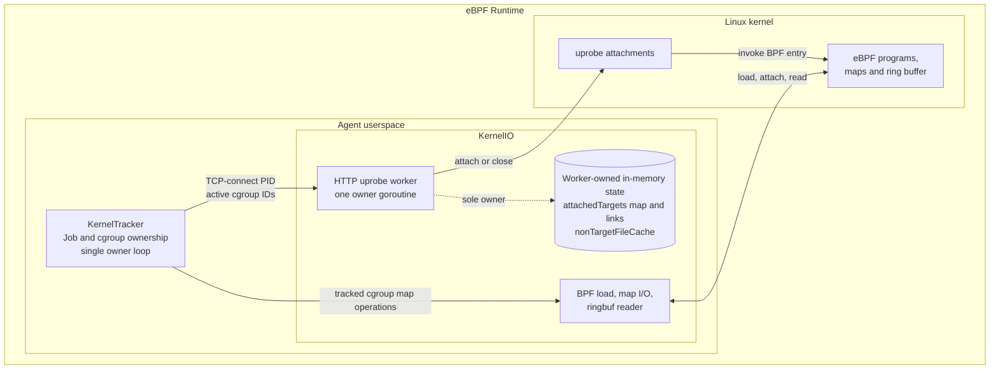
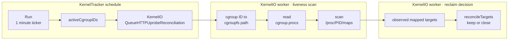

# HTTP Uprobe Runtime

cicd-sensor uses uprobes to observe HTTP requests before a userspace library
encrypts or encodes them. Coverage is defined by the library function that a
workload calls, not by a language, package manager, or executable name.

## Architecture

The HTTP uprobe worker is owned by KernelIO and runs as one owner goroutine.
Attach, reconciliation, and close operations are therefore serialized; the
worker is not pinned to one OS thread, but no second goroutine reads or mutates
its target state.

In this documentation, **eBPF Runtime** means the complete kernel-observation
layer: KernelTracker and KernelIO in Agent userspace plus the BPF programs,
maps, ring buffer, and uprobe attachments loaded into the Linux kernel. It is
an architectural term, not another Go component or goroutine.

The following diagram extracts the kernel-observation portion of the
[Agent architecture](../agent.md#architecture) and adds the HTTP-specific
worker and kernel resources.

KernelTracker remains the owner of Job and cgroup state. KernelIO owns
kernel-facing resources. The HTTP uprobe worker is a specialized KernelIO
lifecycle owner; it does not own Jobs or evaluate rules.

## Coverage status

Current and planned coverage are deliberately separated:

| Protocol path | Status |
| --- | --- |
| OpenSSL HTTP/1.x through `SSL_write` / `SSL_write_ex` | Implemented; rollout disabled |
| HTTP/2 through `nghttp2_submit_request` / `nghttp2_submit_request2` | Planned |

The OpenSSL path uses the existing `http_request` event, and the planned
nghttp2 path will reuse it. Raw request bytes, ordinary headers, and bodies must
not leave the kernel. OpenSSL rollout remains disabled until environment
compatibility and first-request timing are verified. A failed timing gate
requires an earlier discovery trigger; it does not become an accepted limit.

## Runtime model

An uprobe associates a BPF program with a function offset in an ELF file. The
kernel runs that program when a process enters the function. cicd-sensor
attaches by mapped file and symbol, not by PID, so processes that map the same
file can share one attachment.

| Term | Meaning in cicd-sensor |
| --- | --- |
| target | One mapped executable file identified by device and inode. |
| uprobe link | The userspace handle for one target symbol. Closing it detaches that symbol. |
| attached target | One target and all of its links, owned by the HTTP uprobe worker. |
| non-target cache | A bounded cache of files that define none of the selected symbols. It owns no links. |

The attachment can be reached by processes outside a CI Job because it belongs
to the mapped file. Every uprobe BPF program therefore checks
`tracked_cgroups` before parsing or emitting an event.

## Lifecycle

One worker in `internal/agent/kerneltracker/kernelio` owns all HTTP uprobe links
and classification state. It serially handles two inputs:

- a PID after a tracked process makes a TCP connection;
- an active-cgroup snapshot from the periodic reconciliation timer.

### 1. Connect-triggered attach

A TCP connection is a discovery signal. It tells cicd-sensor which process
mappings to inspect; the connection itself is not the attachment.

```mermaid
flowchart LR
    subgraph TRIGGER["Connection trigger"]
        direction TB
        P["Tracked process<br/>TCP connect"]
        N["internal/agent/bpf<br/>connect4 / connect6 sample"]
        P --> N
    end

    subgraph KT["internal/agent/kerneltracker"]
        D["enqueueKernelSample<br/>decode and extract PID"]
    end

    subgraph KIO["internal/agent/kerneltracker/kernelio"]
        direction LR
        subgraph DISPATCH["Worker dispatch"]
            direction TB
            Q["QueueHTTPUprobeDiscovery<br/>bounded non-blocking queue"]
            W["httpUprobeDiscovery.run<br/>single worker"]
            Q --> W
        end
        subgraph ATTACH_FLOW["Mapping discovery and attach"]
            direction TB
            M["discoverAndAttachTargets<br/>scan /proc/PID/maps"]
            A["classifyAndAttach<br/>open map_files and resolve symbols"]
            L["attachTarget<br/>store uprobe links"]
            M --> A --> L
        end
        W --> M
    end

    N --> D --> Q
```

The worker coalesces queued PIDs. For each executable mapping:

| Classification result | Worker action |
| --- | --- |
| already attached | Keep the existing links. |
| present in the non-target cache | Skip symbol resolution. |
| at least one selected symbol attaches | Store the links as one attached target. |
| every selected symbol is absent | Add the file to the non-target cache. |
| permission, I/O, or another transient failure | Store nothing; retry after a later connect. |

The queue is non-blocking so discovery cannot stop kernel-sample intake. The
process scan and attach run asynchronously after the connect sample, so their
timing relative to the first TLS write must be verified before rollout. If the
first-request capture rate is not acceptable, discovery must move to an earlier
process or executable-mapping signal rather than treating the miss as a
permanent coverage limit. A later connection remains the retry trigger for a
transient discovery failure.

### 2. Event delivery after attach

Attaching a link does not itself create an `http_request`. An event starts when
a tracked process later calls an attached function.

```mermaid
flowchart LR
    P["Tracked process<br/>calls selected function"]

    subgraph BPF["internal/agent/bpf"]
        direction TB
        U["uprobe entry<br/>handle_ssl_write (current)"]
        G["tracked_cgroups gate"]
        H["http_helpers.bpf.h<br/>bounded parse and query removal"]
        R["events ring buffer<br/>http_request_sample"]
        U --> G --> H --> R
    end

    subgraph USERSPACE["Agent userspace delivery"]
        direction TB
        READ["kernelio<br/>raw sample reader"]
        DECODE["kerneltracker<br/>decodeKernelSample"]
        ATTR["kerneltracker<br/>attribute Job and create EventRecord"]
        READ --> DECODE --> ATTR
    end

    subgraph JOB["internal/agent/job"]
        EVAL["Job event worker<br/>CEL evaluation and output"]
    end

    P --> U
    R --> READ
    ATTR --> EVAL
```

The parser emits only method, query-stripped path, host, source, and process
identity. An untracked process reaches the same attached function but is dropped
at the cgroup gate before parsing.

#### Captured fields

`http_request` adds the HTTP operation to the network context. In particular,
`path` distinguishes requests to different APIs on the same otherwise legitimate
host, which cannot be determined from `domain` or `network_connect` alone.

| Field | Captured value |
| --- | --- |
| `method` | Request method, normalized to lowercase for rule evaluation. |
| `path` | Request path with the query removed in eBPF, then normalized to lowercase. |
| `host` | HTTP/1.x `Host` or planned HTTP/2 `:authority`, normalized to lowercase; a port can remain. |
| `source` | Capture path: `openssl` today and `nghttp2` when the planned HTTP/2 tap is implemented. |
| `process` | KernelTracker's process snapshot for the caller: executable, arguments, and ancestors. |

No query, other request header, or body is emitted. This is both the event
contract and the redaction boundary.

### 3. Reconcile and close

A link does not disappear when one process exits, and one target can be shared
by several Jobs or containers. Link lifetime therefore cannot follow one PID or
one Job. KernelTracker starts one reconciliation every minute; the worker scans
current mappings and closes targets that are no longer used by any tracked
process.

`reconcileTargets` applies three rules:

| Observation | Result |
| --- | --- |
| target is mapped by a tracked process | Reset its missing count. |
| target is absent from a complete scan | Record a first miss. Close the links only if the next complete scan also misses the target. |
| target is absent and a read failure could have hidden a mapping | Mark the scan incomplete; keep the links and the current missing count. |

Reconciliation observes liveness and closes stale targets. It does not classify
or attach files. The active-cgroup snapshot and process mappings are not read
atomically. For example, the worker can attach a target for a new connection
after the snapshot was taken; that older snapshot cannot include the new
cgroup and can miss the fresh target once. Closing only after a second complete
missing observation prevents this one-scan race from detaching the new links.
An incomplete scan neither advances nor resets the missing count.

### Ownership

- The KernelTracker loop owns Job and cgroup tracking. It sends an immutable
  active-cgroup ID snapshot to KernelIO.
- The KernelIO ringbuf reader only forwards raw samples. KernelTracker decodes
  TCP-connect samples and queues their PIDs to the worker. Neither path scans
  files or changes links.
- The HTTP uprobe worker exclusively owns attached targets, links, and the
  non-target cache. Attach and close run serially on this goroutine, so they do
  not require a mutex.
- On shutdown, the worker closes every remaining link.

## Coverage contract

A function is selected only when it exposes method, path, and host before
encryption or protocol encoding; has a stable public argument ABI and a symbol
resolvable from `.symtab` or `.dynsym`; is used by a relevant CI workload; and
can reuse the existing event and lifecycle without weakening redaction. A client
is documented as verified only after a privileged real-client E2E proves the
call path.

### Selected functions

| Function | Status | Reason | Verification |
| --- | --- | --- | --- |
| [`SSL_write`](https://docs.openssl.org/master/man3/SSL_write/) | Implemented; rollout disabled | OpenSSL HTTP/1.x plaintext buffer is argument 2 and length is argument 3. | curl and wget HTTP/1.1 E2E |
| [`SSL_write_ex`](https://docs.openssl.org/master/man3/SSL_write/) | Implemented; rollout disabled | Same relevant argument positions; required by the observed Python path. | Python `urllib.request`, requests, and pip E2E |
| [`nghttp2_submit_request`](https://nghttp2.org/documentation/nghttp2_submit_request.html) | Planned | Exposes `nghttp2_nv` before HPACK; `nva` is argument 3 and `nvlen` is argument 4. | Implementation and real-client E2E required |
| [`nghttp2_submit_request2`](https://nghttp2.org/documentation/nghttp2_submit_request2.html) | Planned | Same relevant argument positions; complements `submit_request` across versions. | Implementation and real-client E2E required |

One BPF entry is shared when selected symbols have the same argument and parse
contract.

### Workload status

Each verified status has a reproducible real-client E2E on GitHub-hosted
Ubuntu. `Not covered (verified)` means that the same E2E confirmed the absence
of an OpenSSL `http_request` event for that runner image.

| Workload | Status | Verification |
| --- | --- | --- |
| curl over HTTPS HTTP/1.1 | Verified | GitHub-hosted Ubuntu 22.04, 24.04, and 26.04 preview on x64 and arm64; observes `SSL_write`. |
| Python `urllib.request` over HTTPS HTTP/1.1 | Verified | GitHub-hosted Ubuntu 22.04, 24.04, and 26.04 preview on x64 and arm64; observes `SSL_write_ex`. |
| Python requests over HTTPS HTTP/1.x | Verified | GitHub-hosted Ubuntu 22.04, 24.04, and 26.04 preview on x64 and arm64; observes `SSL_write_ex`. |
| pip over HTTPS | Verified | GitHub-hosted Ubuntu 22.04, 24.04, and 26.04 preview on x64 and arm64; observes `SSL_write_ex`. |
| Node over HTTPS HTTP/1.x | Not covered (verified) | GitHub-hosted Ubuntu 22.04, 24.04, and 26.04 preview on x64 and arm64 do not expose a selected attachable function path. |
| npm over HTTPS | Not covered (verified) | Uses the same uncovered Node TLS path on the verified runner images. |
| wget over HTTPS HTTP/1.x | Verified on 22.04 and 24.04 | GitHub-hosted x64 and arm64 observe `SSL_write`; Ubuntu 26.04 preview uses GnuTLS and is not covered. |
| Git over HTTPS | Not covered (verified) | GitHub-hosted Ubuntu 22.04, 24.04, and 26.04 preview on x64 and arm64 use a GnuTLS-backed Git HTTP helper. |
| curl or Node over HTTP/2 | Planned | Requires nghttp2 support. |
| Go, Java, or rustls-based HTTPS | Not covered | Does not call a selected function. |
| Python `h2` / httpx HTTP/2 | Not covered | Does not use nghttp2 for request submission. |

## Known limits

- Only calls through the selected library functions are visible. HTTPS through
  Go `crypto/tls`, Java JSSE, Rust rustls, Python `h2`, a non-nghttp2 HTTP/2
  stack, or an unverified OpenSSL-like fork does not expose request fields to
  these uprobes.
- Static linking is not itself unsupported. A dynamically or statically linked
  target is attachable only when the selected function can be resolved from its
  `.symtab` or `.dynsym`. A stripped static binary without that symbol is not
  captured.
- HTTP/1.x parsing starts at one write boundary. Split request lines or a `Host`
  outside the bounded prefix can be missed.
- HTTP/2 is visible only before HPACK in a selected nghttp2 API. HTTP/2 already
  encoded at `SSL_write`, h2c, and HTTP/3/QUIC are not parsed.
- Retries can produce duplicate events. Capture is not exactly once.
- Absence of `http_request` is not proof that no egress occurred. Rules should
  retain `network_connect` coverage; `domain` can also be absent when name
  resolution uses an encrypted path such as DNS over HTTPS.
