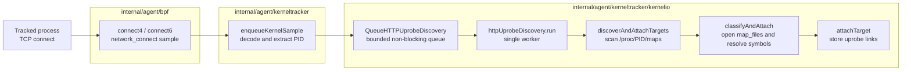
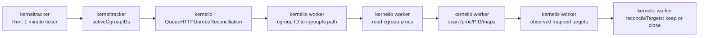

# HTTP Uprobe Runtime

cicd-sensor uses uprobes to observe HTTP requests before a userspace library
encrypts or encodes them. Coverage is defined by the library function that a
workload calls, not by a language, package manager, or executable name.

Current and planned coverage are deliberately separated:

| Protocol path | Status |
| --- | --- |
| OpenSSL HTTP/1.x through `SSL_write` / `SSL_write_ex` | Implemented; rollout disabled |
| HTTP/2 through `nghttp2_submit_request` / `nghttp2_submit_request2` | Planned |

The OpenSSL path uses the existing `http_request` event, and the planned
nghttp2 path will reuse it. Raw request bytes, ordinary headers, and bodies must
not leave the kernel.

## Runtime model

An uprobe associates a BPF program with a function offset in an ELF file. The
kernel runs that program when a process enters the function. cicd-sensor
attaches by mapped file and symbol, not by PID, so processes that map the same
file can share one attachment.

| Term | Meaning in cicd-sensor |
| --- | --- |
| target | One mapped executable file identified by device and inode. |
| uprobe link | The userspace handle for one target symbol. Closing it detaches that symbol. |
| attached target | One target and all of its links, owned by the HTTP uprobe worker. |
| non-target cache | A bounded cache of files that define none of the selected symbols. It owns no links. |

The attachment can be reached by processes outside a CI Job because it belongs
to the mapped file. Every uprobe BPF program therefore checks
`tracked_cgroups` before parsing or emitting an event.

## Lifecycle

One worker in `internal/agent/kerneltracker/kernelio` owns all HTTP uprobe links
and classification state. It serially handles two inputs:

- a PID after a tracked process makes a TCP connection;
- an active-cgroup snapshot from the periodic reconciliation timer.

### 1. Connect-triggered attach

A TCP connection is a discovery signal. It tells cicd-sensor which process
mappings to inspect; the connection itself is not the attachment.

The worker coalesces queued PIDs. For each executable mapping:

| Classification result | Worker action |
| --- | --- |
| already attached | Keep the existing links. |
| present in the non-target cache | Skip symbol resolution. |
| at least one selected symbol attaches | Store the links as one attached target. |
| every selected symbol is absent | Add the file to the non-target cache. |
| permission, I/O, or another transient failure | Store nothing; retry after a later connect. |

The queue is non-blocking so discovery cannot stop kernel-sample intake. The
tradeoff is best-effort first-request coverage: the first request can occur
before attachment, and a later connection becomes the normal retry trigger.

### 2. Event delivery after attach

Attaching a link does not itself create an `http_request`. An event starts when
a tracked process later calls an attached function.

```mermaid
flowchart LR
    P["Tracked process<br/>calls selected function"]

    subgraph BPF["internal/agent/bpf"]
        U["uprobe entry<br/>handle_ssl_write (current)"]
        G["tracked_cgroups gate"]
        H["http_helpers.bpf.h<br/>bounded parse and query removal"]
        R["events ring buffer<br/>http_request_sample"]
    end

    subgraph KIO["internal/agent/kerneltracker/kernelio"]
        READ["Kernel sample reader"]
    end

    subgraph KT["internal/agent/kerneltracker"]
        DECODE["decodeKernelSample"]
        ATTR["attribute cgroup to Job<br/>create EventRecord"]
    end

    subgraph JOB["internal/agent/job"]
        EVAL["Job event worker<br/>CEL evaluation and output"]
    end

    P --> U --> G --> H --> R --> READ --> DECODE --> ATTR --> EVAL
```

The parser emits only method, query-stripped path, host, source, and process
identity. An untracked process reaches the same attached function but is dropped
at the cgroup gate before parsing.

### 3. Reconcile and close

A link does not disappear when one process exits, and one target can be shared
by several Jobs or containers. Link lifetime therefore cannot follow one PID or
one Job. KernelTracker starts one reconciliation every minute; the worker scans
current mappings and closes targets that are no longer used by any tracked
process.

`reconcileTargets` applies three rules:

| Observation | Result |
| --- | --- |
| target is mapped by a tracked process | Reset its missing count. |
| target is absent from a complete scan | Increment its missing count; close the links when the count reaches two. |
| target is absent and a read failure could have hidden a mapping | Mark the scan incomplete; keep the links and the current missing count. |

Reconciliation observes liveness and closes stale targets. It does not classify
or attach files. A target must be absent from two complete scans. When the
target is absent, an incomplete scan neither advances nor resets that count.
This avoids detaching during process or cgroup teardown races.

### Ownership

- The KernelTracker loop owns Job and cgroup tracking. It sends an immutable
  active-cgroup ID snapshot to KernelIO.
- The kernel sample reader only decodes a TCP connect and queues its PID. It
  never scans files or changes links.
- The HTTP uprobe worker exclusively owns attached targets, links, and the
  non-target cache. Attach and close run serially on this goroutine, so they do
  not require a mutex.
- On shutdown, the worker closes every remaining link.

## Coverage contract

A function is selected only when it exposes method, path, and host before
encryption or protocol encoding; has a stable public argument ABI and a symbol
resolvable from `.symtab` or `.dynsym`; is used by a relevant CI workload; and
can reuse the existing event and lifecycle without weakening redaction. A client
is documented as verified only after a privileged real-client E2E proves the
call path.

### Selected functions

| Function | Status | Reason | Verification |
| --- | --- | --- | --- |
| [`SSL_write`](https://docs.openssl.org/master/man3/SSL_write/) | Implemented; rollout disabled | OpenSSL HTTP/1.x plaintext buffer is argument 2 and length is argument 3. | curl HTTP/1.1 E2E |
| [`SSL_write_ex`](https://docs.openssl.org/master/man3/SSL_write/) | Implemented; rollout disabled | Same relevant argument positions; required by the observed Python path. | Python `urllib.request` E2E |
| [`nghttp2_submit_request`](https://nghttp2.org/documentation/nghttp2_submit_request.html) | Planned | Exposes `nghttp2_nv` before HPACK; `nva` is argument 3 and `nvlen` is argument 4. | Implementation and real-client E2E required |
| [`nghttp2_submit_request2`](https://nghttp2.org/documentation/nghttp2_submit_request2.html) | Planned | Same relevant argument positions; complements `submit_request` across versions. | Implementation and real-client E2E required |

One BPF entry is shared when selected symbols have the same argument and parse
contract. Adjacent APIs are not hooked preemptively.

### Not selected

| Function or stack | Reason |
| --- | --- |
| `SSL_write_early_data`, `SSL_write_ex2` | No verified CI workload requires them. |
| `nghttp2_submit_headers` | No inspected common CI client creates ordinary requests through it; it has a different argument ABI. |
| Go `crypto/tls` / `net/http2` | Does not use the selected OpenSSL or nghttp2 APIs. |
| Java JSSE, Rust rustls / `h2`, Python `h2` | Uses a different TLS or HTTP/2 implementation. |
| BoringSSL and other OpenSSL-like forks | Not part of the supported ABI contract unless separately verified. |

### Workload status

Tool names are evidence, not the attachment contract. Distribution builds,
static linking, symbol visibility, protocol negotiation, and library versions
can change the actual function path.

| Workload | Status | Boundary |
| --- | --- | --- |
| curl over HTTPS HTTP/1.1 | Verified | E2E observes `SSL_write`. |
| Python `urllib.request` over HTTPS HTTP/1.1 | Verified | E2E observes `SSL_write_ex`. |
| pip / requests | Not separately verified | Requires the Python/OpenSSL build to call a selected symbol. |
| Node / npm over HTTPS HTTP/1.x | Not separately verified | [Node TLS uses OpenSSL](https://nodejs.org/api/tls.html), but a build can differ in symbol visibility and write API. |
| wget over HTTPS HTTP/1.x | Not separately verified | Coverage depends on its TLS backend and selected write function. |
| Git over HTTPS | Not separately verified | Its libcurl TLS backend and negotiated HTTP version determine the function path. |
| curl or Node over HTTP/2 | Planned only | Requires a build that calls a selected nghttp2 request API. |
| Go, Java, or rustls-based HTTPS | Not covered | It does not cross a selected uprobe boundary. |
| Python `h2` / httpx HTTP/2 | Not covered | It does not use nghttp2 for request submission. |

## Known limits

- Discovery is best-effort; the first request from a newly observed target can
  occur before attachment.
- A target absent from both `.symtab` and `.dynsym` cannot be attached by name.
- HTTP/1.x parsing starts at one write boundary. Split request lines or a `Host`
  outside the bounded prefix can be missed.
- HTTP/2 is visible only before HPACK in a selected nghttp2 API. HTTP/2 already
  encoded at `SSL_write`, h2c, and HTTP/3/QUIC are not parsed.
- Retries can produce duplicate events. Capture is not exactly once.
- Absence of `http_request` is not proof that no egress occurred. Rules should
  retain `domain` and `network_connect` coverage where appropriate.
