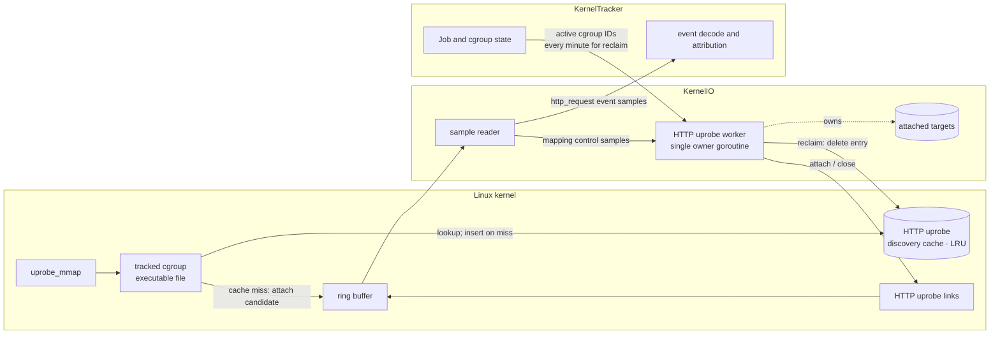
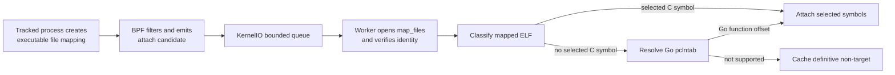
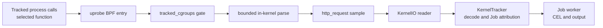

# HTTP Uprobe Runtime

This chapter defines the userspace-library HTTP capture runtime: why it exists,
how it discovers and attaches uprobes, how requests become events, and how
attachments are reclaimed. Cleartext HTTP capture at `tcp_sendmsg` uses the same
`http_request` event but does not use this discovery lifecycle.

OpenSSL HTTP/1.x, nghttp2 HTTP/2, and Go `net/http` HTTPS capture are implemented.
They remain disabled by default while first-request timing and environment
compatibility are evaluated.

## Purpose and scope

Network destination alone is not always enough to identify a malicious action.
An upload to `github.com`, for example, can use a legitimate domain while sending
credentials or artifacts to an attacker-controlled repository. A `domain` event
can also be absent when a process resolves names through DNS over HTTPS, leaving
`network_connect` with only an IP address.

`http_request` adds method, query-stripped path, host, capture source, and process
identity. These fields create more detection and investigation points for
operations that otherwise share the same destination.

There is no universal capture point for every HTTP request. TLS and HTTP
implementations expose plaintext at different functions, some binaries do not
retain attachable symbols, and HTTP/2 or HTTP/3 can encode a request before a
generic write function sees it. Complete coverage is therefore not a design
claim. The design does not treat avoidable capture gaps as acceptable: each
supported function path should attach as early as practical, and measured misses
should drive additional catch-up mechanisms when their benefit justifies the
cost.

`http_request` is a supplemental signal, not a complete egress record. Its
absence does not prove that no HTTP or network communication occurred.

## Architecture

HTTP uprobe discovery is part of the [eBPF Runtime](../ebpf-runtime.md). KernelIO
owns kernel-facing resources and one HTTP uprobe worker. KernelTracker owns Jobs,
tracked cgroups, process context, and event attribution.

For each executable file mapping, BPF checks the LRU cache and inserts the file on a
miss before emitting an attach candidate. Reclaim removes the cache entry in
userspace before closing the corresponding links. Transient work failure and a
full worker queue also remove the entry so a later mapping can retry.

The Job and cgroup state edge is reclaim input only: KernelTracker sends active
cgroup IDs once per minute. Attach discovery starts when KernelIO reads an
attach candidate from the ring buffer, not from Job state.

The worker serializes attach candidates and reconciliation requests on one
goroutine. No other goroutine reads or mutates its attached-target state, so
classification, attach, and close do not require a mutex.

### Retained runtime state

| Type | State | Purpose and identity | Access | Bound and removal |
| --- | --- | --- | --- | --- |
| Worker-owned registry | `attachedTargets` (`attachedUprobeTarget` entries) | Keyed by `mappedFileIdentity` (device, inode); stores the classification key, uprobe links, and consecutive complete-miss count for each attached file | HTTP uprobe worker only | 4,096 files; reclaim removes an entry after two complete misses |
| Shared BPF cache | `http_uprobe_discovery_cache` | Keyed by `fileClassificationKey` (device, inode, ctime); suppresses callbacks for files already queued, classified, or attached | BPF hook, KernelIO reader, and worker | 65,536-entry LRU; failed work and reclaim remove entries |

The cache is notification suppression, not the link registry. Eviction can cause
another classification, but it cannot detach or lose a link. `attachedTargets`
remains the source of truth for attached links.

An uprobe link belongs to a mapped file, not to one PID or Job. Processes can
share the same file and attachment. Every HTTP uprobe BPF entry therefore checks
`tracked_cgroups` before parsing or emitting an event.

## Discovery and attachment

### Discovery model

Mapping notification is the primary discovery path. It reacts when a process in
a tracked cgroup receives a new executable file mapping, before the selected
library function is called.

This also covers mappings created by later Jobs and containers on long-lived
self-hosted or Kubernetes runners, provided their cgroup is already tracked.
ELF inspection and attachment still run asynchronously in userspace, so the
selected function can run first and the initial request can be missed.

Each candidate carries a `fileClassificationKey` made from device, inode, and
ctime. This identifies one file version across BPF filtering and userspace
identity verification.

| Mechanism | Status | Purpose | Trade-off |
| --- | --- | --- | --- |
| executable mapping notification | Implemented; primary | Reacts to each new executable file mapping without scanning every process. | The first request can run before attachment and be missed. |
| initial process scan | Not implemented | Could recover mappings that existed before tracking began. | A one-time snapshot cannot discover later processes or mappings. |
| periodic process scan | Not implemented | Could provide a catch-up path for missed notifications. | Adds recurring scan cost and cannot guarantee the first request. |

The current implementation uses mapping notifications only. Initial and
periodic process scans can be considered later if production measurements show
that an additional catch-up path is necessary.

Mapping notification is also not limited to dynamically linked libraries. A
statically linked executable, including a Go binary, creates executable file
mappings when it starts. The same discovery trigger therefore feeds both ELF
symbol lookup and the Go-specific pclntab resolver.

The implemented attach path is:

### Kernel-side candidate filtering

`fentry/uprobe_mmap` receives a completed VMA and its backing file. The BPF
program emits an attach candidate only when all of these conditions hold:

- the VMA is executable and file-backed;
- the current cgroup is present in `tracked_cgroups`;
- the file is not already queued, classified, or attached according to
  `http_uprobe_discovery_cache`.

One ELF can create several executable VMAs. Dedup therefore uses the file key
above rather than the VMA range or process identity. Filtering and dedup stay in
BPF because the kernel already has these values and rejecting a candidate there
avoids a ring-buffer sample and userspace work.

The attach candidate contains discovery metadata only. It carries no HTTP bytes
or file content.

### Userspace classification and attach

The KernelIO sample reader recognizes an HTTP uprobe attach candidate and puts it
on a bounded, non-blocking worker queue. Attach candidates do not enter
KernelTracker, Job attribution, or CEL evaluation.

The worker handles each candidate serially:

1. Open the mapped file through `/proc/<pid>/map_files` and verify its device,
   inode, and ctime. A changed mapping is ignored and not cached.
2. Look for selected C functions in `.symtab` and `.dynsym`. If none are
   defined, try the Go pclntab resolver described in
   [Go net/http Uprobes](go-http-uprobes.md).
3. Attach selected symbols or resolved file offsets, store their links as one
   attached target, and keep the discovery-cache entry.
4. If neither resolver finds a supported function, keep the cache entry.
5. On a transient failure or queue drop, remove the cache entry so a later
   mapping can retry.

## Event capture and delivery

Attachment prepares a capture point; it does not emit an event. A later call to
an attached function enters the existing security-event path.

### Capture points

| Function | Protocol path | Input contract | Source |
| --- | --- | --- | --- |
| [`SSL_write`](https://docs.openssl.org/master/man3/SSL_write/) | OpenSSL HTTP/1.x | plaintext buffer is argument 2; length is argument 3 | `openssl` |
| [`SSL_write_ex`](https://docs.openssl.org/master/man3/SSL_write/) | OpenSSL HTTP/1.x | same input-buffer argument positions | `openssl` |
| [`nghttp2_submit_request`](https://nghttp2.org/documentation/nghttp2_submit_request.html) | nghttp2 HTTP/2 | `nghttp2_nv` array is argument 3; count is argument 4 | `nghttp2` |
| [`nghttp2_submit_request2`](https://nghttp2.org/documentation/nghttp2_submit_request2.html) | nghttp2 HTTP/2 | same relevant argument positions | `nghttp2` |
| [`net/http.(*Transport).roundTrip`](go-http-uprobes.md) | Go `net/http` HTTPS, HTTP/1.x and HTTP/2 | `*http.Request` is ABIInternal integer argument 2; stripped Go 1.18-1.27 binaries are resolved through pclntab | `go_net_http` |

Selected functions with the same argument and parsing contract share one BPF
entry.

The OpenSSL path reads an HTTP/1.x request line and `Host` before encryption.
The nghttp2 path reads `:method`, `:path`, and `:authority` before HPACK encoding.
The Go path reads `http.Request` and `url.URL` before protocol encoding. All
produce the same event shape.

### Event and redaction contract

| Field | Value |
| --- | --- |
| `method` | request method, normalized to lowercase for rule evaluation |
| `path` | origin-form request path, with query excluded by the BPF capture, then normalized to lowercase |
| `host` | HTTP/1.x `Host`, HTTP/2 `:authority`, or Go `Request.Host` / `URL.Host`, normalized to lowercase; a port can remain |
| `source` | `openssl`, `nghttp2`, or `go_net_http` |
| `process` | KernelTracker process snapshot for the caller |

Raw request bytes, query parameters, other headers, and bodies do not cross the
kernel boundary. This is the redaction invariant.

## Link lifetime and reclaim

An uprobe link remains active until userspace closes it. Process exit, container
deletion, and pathname unlink do not establish that no tracked process can still
execute the mapped file. A file can also be shared by several Jobs or containers.
Link lifetime therefore cannot follow one PID, Job, pathname, or cgroup owner.

KernelTracker starts reconciliation once per minute and sends an immutable
snapshot of active cgroup IDs to the worker. The worker expands that snapshot to
current process mappings and compares them with attached targets.

```mermaid
flowchart LR
    TICK["KernelTracker<br/>1 minute ticker"]
    IDS["snapshot active<br/>cgroup IDs"]
    PATHS["Worker resolves<br/>cgroupfs paths"]
    PIDS["read cgroup.procs"]
    MAPS["read process maps"]
    COMPARE["compare with<br/>attached targets"]
    CACHE["remove discovery<br/>cache entry"]
    CLOSE["close links and remove<br/>attached target"]

    TICK --> IDS --> PATHS --> PIDS --> MAPS --> COMPARE
    COMPARE -->|"two complete misses"| CACHE --> CLOSE
```

Reconciliation observes liveness only. It does not classify or attach files.

| Observation | Action |
| --- | --- |
| target mapped by any tracked process | Reset its complete-miss count to zero. |
| target absent from a complete scan | Increment the count; after two consecutive complete misses, remove its `http_uprobe_discovery_cache` entry, then close its links and remove it from `attachedTargets`. |
| discovery-cache deletion fails | Keep the links and registry entry so a later reconciliation can retry safely. |
| any walk or read failure could hide a mapping | Keep the links and leave the count unchanged. |

The cgroup snapshot, process-map reads, and mapping notifications are not atomic.
A target attached after the snapshot can appear absent from that scan even while
it is live. Requiring a second complete miss prevents this one-scan race from
closing a fresh attachment. Incomplete scans are fail-keep because they cannot
prove absence.

The HTTP uprobe worker is the only component that attaches or closes links. It
closes every remaining link during shutdown.

## Coverage

Coverage is defined by an observed function path, not by a tool name. A client is
verified only when a reproducible real-client E2E produces the expected source
and request fields. `Not covered (verified)` means the same environment was
tested and did not call a selected function.

Verified rows below use GitHub-hosted Ubuntu 22.04, 24.04, and 26.04 preview on
x64 and arm64 unless noted otherwise.

| Workload | Status | Observed path |
| --- | --- | --- |
| curl over HTTPS HTTP/1.1 | Verified | `SSL_write` |
| Python `urllib.request`, requests, and pip over HTTPS HTTP/1.x | Verified | `SSL_write_ex` |
| Node and npm over HTTPS HTTP/1.x | Verified | `SSL_write` |
| wget over HTTPS HTTP/1.x | Verified on 22.04 and 24.04 | `SSL_write`; Ubuntu 26.04 preview uses GnuTLS and is not covered. |
| Git over HTTPS HTTP/1.x | Not covered (verified) | GitHub-hosted Ubuntu uses a GnuTLS-backed Git HTTP helper. |
| curl and Node over HTTPS HTTP/2 | Verified | selected nghttp2 request API |
| Git over HTTPS HTTP/2 | Verified | selected nghttp2 request API for default negotiation and explicit `http.version=HTTP/2` |
| GitHub CLI (`gh api`) | Verified | `net/http.(*Transport).roundTrip` |
| GitLab CLI (`glab`) | Not yet verified | Real-client E2E pending. |
| Java or rustls-based HTTPS | Not covered | Does not call a currently selected function. |
| Python `h2` / httpx HTTP/2 | Not covered | Does not use nghttp2 for request submission. |

## Operational status and known limits

- HTTP uprobes are rollout-disabled in shipped builds. The internal switch is a
  temporary rollout control, not a permanent user-facing opt-in.
- Mapping notification precedes the selected function call, but ELF
  classification and attachment are asynchronous. The function can run before
  its uprobe is attached, so the initial request can be missed. This remains a
  rollout gate.
- Discovery observes executable mappings created while the process is already in
  a tracked cgroup. Initial catch-up scanning, periodic attach backstop, moving an
  existing process into a tracked cgroup, and later `mprotect(PROT_EXEC)` are not
  current discovery paths.
- C library capture requires a selected function in `.symtab` or `.dynsym`.
  Go capture accepts only the pclntab layouts and ABI/object-layout range listed
  in [Go net/http Uprobes](go-http-uprobes.md).
- HTTP/1.x parsing starts at one write boundary. A split request line or `Host`
  outside the bounded prefix can be missed.
- HTTP/2 is visible only before HPACK in a selected nghttp2 API. Other HTTP/2
  implementations and HTTP/3/QUIC are not parsed.
- The nghttp2 parser examines at most 32 pseudo-headers and requires `:method`
  and an origin-form `:path`. Standard CONNECT has no `:path` and is not emitted;
  extended CONNECT can be emitted but `:protocol` is not exposed.
- The nghttp2 tap drops methods longer than 15 bytes and paths longer than 255
  bytes. A missing, invalid, or oversized `:authority` produces an empty host.
- Retries can produce duplicate events. Capture is not exactly once.
