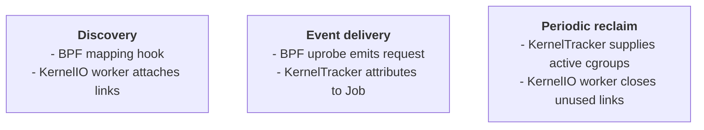
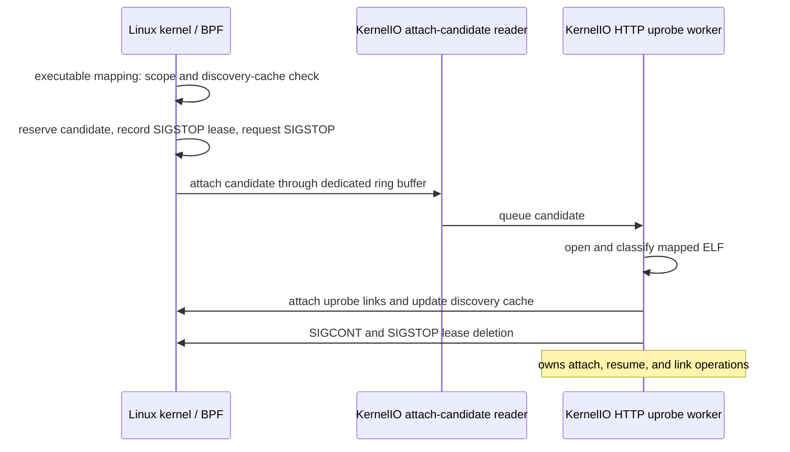
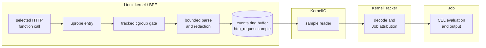
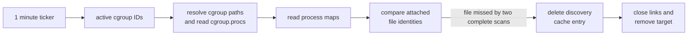

# HTTP Uprobe Runtime

This chapter defines how cicd-sensor discovers HTTP client code, attaches
uprobes, emits `http_request` events, and reclaims links. Cleartext HTTP capture
at `tcp_sendmsg` produces the same event but does not use this runtime.

OpenSSL HTTP/1.x, nghttp2 HTTP/2, and Go `net/http` HTTPS capture are
implemented. All `http_request` capture remains disabled by default while the
bounded first-call SIGSTOP and environment compatibility gates are evaluated.
Operators can always disable it with `--enable-http-request=false`. When
disabled, both the cleartext tap and the HTTP uprobe runtime are inactive.

## Purpose and limits

Network destination alone is not always enough to identify a malicious action.
An upload to `github.com`, for example, can use a legitimate domain while
sending credentials or artifacts to an attacker-controlled repository. A
`domain` event can also be absent when a process uses DNS over HTTPS, leaving
`network_connect` with only an IP address.

`http_request` adds the method, query-stripped path, host, capture source, and
calling process. These fields provide additional detection and investigation
points for operations that otherwise share the same destination.

There is no universal capture point for every HTTP implementation. Plaintext is
available at different functions, some binaries have no attachable symbol, and
HTTP/2 or HTTP/3 may encode a request before a generic write function sees it.
This runtime therefore expands coverage for selected, verified function paths;
it does not claim complete HTTP visibility. An absent `http_request` event does
not prove that no HTTP or network communication occurred.

## Runtime architecture

HTTP uprobes are part of the [eBPF Runtime](../ebpf-runtime.md). KernelIO owns
kernel-facing resources and one HTTP uprobe worker. JobRegistry owns Jobs.
KernelTracker owns tracked-cgroup and process tracking state, and attributes
decoded kernel events to Job IDs.

The runtime has three distinct paths. Discovery sends executable mappings to
the worker for classification and attachment. Event delivery bypasses that
worker and follows the normal kernel-event path. Reclaim periodically tells the
worker which tracked cgroups remain active so it can close unused links.

## Discovery and attachment

Discovery reacts whenever a process in a tracked cgroup installs a file-backed
executable mapping. This normally happens for the main executable and shared
libraries during process startup, but it also covers libraries mapped later
through `dlopen` or an equivalent path. It is not a process-start-only hook.

The mapping hook runs before userspace can execute code from that mapping, but
ELF classification and uprobe attachment require userspace work. With
notification alone, a short-lived client can call the selected function first.
Fresh-process experiments reproduced this race: some first HTTPS requests
completed before attachment and were missed.

Attach candidates remain inside KernelIO and never enter KernelTracker
attribution or CEL evaluation. They use the dedicated 1 MiB
`http_uprobe_attach_candidates` ring buffer and reader, so backlog or drops in
the normal `events` ring buffer do not queue them behind security events. The
independent reader sends candidates directly to the HTTP uprobe worker without
waiting for normal event processing.

### Attach lifecycle

The implemented lifecycle is:

1. BPF accepts only a file-backed executable mapping in a tracked cgroup that
   is absent from `http_uprobe_discovery_cache`.
2. BPF reserves the dedicated attach-candidate ring buffer, records a
   process-generation SIGSTOP lease, and requests SIGSTOP before returning to
   userspace.
3. The dedicated KernelIO reader queues the candidate directly to the worker.
4. The worker waits for visible tasks to enter the SIGSTOP state, classifies the
   mapped ELF, scans the process's other executable mappings, and attaches
   selected functions.
5. The worker immediately sends SIGCONT and deletes the lease. Every five
   seconds, the same worker also resumes leases at least five seconds old.

A second mapping created under the same process SIGSTOP lease is queued without
sending another SIGSTOP. Its discovery-cache entry remains `pending` until
classification finishes. The stopped-process scan handles pending mappings
before SIGCONT; a later explicit candidate is harmless because attached targets
and resolved non-targets are idempotent.

**Why accept this trade-off.** SIGSTOP is an unusual observation barrier and
would be a poor default for a latency-sensitive production service. cicd-sensor
observes short-lived CI/CD Jobs, where a bounded first-seen pause is easier to
accept, while a single outbound HTTP request can be the entire exfiltration
attempt. The design therefore prioritizes reliable first-request capture over
zero scheduling intervention.

Successful attachment resumes the process immediately. A five-second worker
sweep is the abnormal-path safety net: a lease at least five seconds old is
resumed even when attachment did not finish. Because the sweep itself runs every
five seconds, recovery normally occurs between five and ten seconds after
SIGSTOP when the worker is able to run. The worker's synchronous wait for the
process to stop is also limited to five seconds from the BPF timestamp. This is
not an independent watchdog: a worker blocked later in classification or
attachment can delay recovery. Keeping normal completion and expiry on one
goroutine avoids per-process timer callbacks and concurrent SIGCONT paths.

### Candidate classification

`fentry/uprobe_mmap` receives a completed VMA and its backing file. BPF emits an
attach candidate only when the VMA is executable and file-backed, the current
cgroup is tracked, and the file is absent from the discovery cache. One ELF can
create several executable VMAs, so deduplication uses file identity rather than
VMA range or process identity.

The candidate carries device, inode, ctime, VMA range, process generation, and
SIGSTOP state. It contains no HTTP bytes or file content. BPF inserts a
`pending` cache entry before notification so unrelated mappings of the same file
do not create repeated userspace work. Userspace changes it to `resolved` only
after definitive non-target classification or successful attachment.

On the normal path, BPF records the lease and requests SIGSTOP before returning
to userspace, then the worker attaches links before resuming the process. This
preserves first-call capture. The lease allows recovery if the Agent disappears
before sending SIGCONT. Ring-buffer reservation failure removes the cache entry
for a later retry. Failure to establish SIGSTOP falls back to asynchronous
classification. Only those degraded paths, or the expired-lease safety sweep, can
let the first call run before attachment.

The worker handles each file serially:

1. Open it through `/proc/<pid>/map_files` and verify device, inode, and ctime.
   A changed mapping is ignored and not cached.
2. Look for selected C functions in `.symtab` and `.dynsym`. If none are found,
   try the Go pclntab resolver described in
   [Go net/http Uprobes](go-http-uprobes.md).
3. Attach selected symbols or resolved file offsets and store the links as one
   attached target.
4. Keep definitive non-targets in the discovery cache. On transient failure,
   remove the cache entry so a later mapping can retry.

The worker serializes classification, attach, and reclaim on one goroutine, so
no other goroutine mutates its link registry.

### SIGSTOP safety and recovery

On the normal path, attach completion, an error or expired-lease sweep, and
clean Agent shutdown all release the process with SIGCONT. The remaining
failure mode is an
unexpected Agent termination, such as a crash or SIGKILL, after SIGSTOP but
before SIGCONT. The pinned `http_uprobe_stop_leases` map is therefore a recovery
ledger, not a discovery cache. BPF writes the lease before requesting SIGSTOP,
and the map remains available across that abnormal termination.

| Situation | Result and recovery |
| --- | --- |
| attach completes or classification fails | The worker sends SIGCONT and deletes the lease. |
| lease is at least five seconds old | The worker's five-second safety sweep sends SIGCONT and deletes the lease. Attachment may remain incomplete. |
| attach-control reader or candidate handling fails | KernelIO detaches the mapping hook. The worker's safety sweep resumes leases whose candidates could not be consumed. Existing links keep running, but discovery remains disabled until Agent restart. |
| clean Agent shutdown | KernelIO first detaches the mapping hook, stops the worker, sweeps the pinned ledger for queued or in-flight candidates, then unpins the empty ledger. |
| Agent receives SIGKILL or crashes after SIGSTOP | No userspace cleanup can run. The workload can remain in the SIGSTOP state until cicd-sensor starts again. On startup, before attaching the mapping hook, KernelIO opens the pinned ledger, verifies each `(tgid, start_boottime)` against `/proc/<pid>/stat`, sends SIGCONT to the matching process, and deletes the lease. If the Agent is not restarted, this recovery does not occur. |
| PID has exited or been reused before startup recovery | The process-generation check fails, so KernelIO deletes the stale lease without signaling the unrelated process. |
| another actor had already sent SIGSTOP | SIGSTOP has no sender ownership that SIGCONT can preserve. Normal completion, safety sweep, shutdown, or startup recovery can resume a process that another actor placed in the SIGSTOP state. This ownership ambiguity is an accepted constraint of the CI runner deployment model. |

Startup recovery runs even when the new Agent starts with
`--enable-http-request=false`. After recovery, the disabled runtime unpins the
unused lease map and does not attach cleartext, discovery, or HTTP uprobe
programs. If recovery fails, Agent initialization fails before the mapping hook
is attached, so the runtime does not create additional stops while old leases
remain unresolved.

### Discovery timing and alternatives

Discovery design has two separate choices: **when** to look for a target and
**which trigger** starts that work. Process exec, file open, and executable
mapping often happen close together during startup, but they expose different
files and have different first-call guarantees.

| Mechanism | Status | Trigger | Coverage and first-call behavior |
| --- | --- | --- | --- |
| **startup process scan** | Not adopted | At Agent startup, scan userspace `/proc`. | Can inspect mappings that already exist, but only for scope that is known at startup. It does not cover later processes and is not a first-call barrier. |
| **process-start scan** | Not adopted | On a process-exec event, scan that PID. | Can see the main executable, but shared libraries can be mapped later by the dynamic loader. The process can also run before userspace classification finishes. |
| **fanotify permission mediation** | Not adopted | Intercept executable opens with `FAN_OPEN_EXEC_PERM`; ordinary shared-library opens require broad `FAN_OPEN_PERM` marks. | Can block an open while userspace decides, but broad marks also deliver unrelated opens before cgroup filtering and add queue, response, and mount-lifecycle failure modes. |
| **mapping notification without SIGSTOP** | Not adopted | On an executable mapping during startup or later `dlopen`, run `fentry/uprobe_mmap`. | Covers the main executable, shared libraries, and later mappings without scanning. It does not pause the workload; fresh-process experiments reproduced missed first HTTPS requests. |
| **mapping notification + bounded SIGSTOP** | Implemented; primary | On the same `fentry/uprobe_mmap` event, filter and deduplicate in BPF. | Normally keeps the process from reaching a selected function until its links are attached, providing reliable first-call capture. Failure to establish SIGSTOP or the safety sweep can still resume before attachment completes. |
| **periodic process scan** | Not adopted | At each configured interval, scan current target processes and mappings. | Can catch up after missed discovery, but adds recurring scan cost and still cannot guarantee the first request. |

The bounded mapping SIGSTOP reuses the existing hook, cache, worker, and ELF
classification path. It does not add a fanotify listener, separate daemon,
Job-owned SIGSTOP state, or another process-scan loop. Startup, process-start, and
periodic scans are not currently planned.

## Event capture and delivery

Attachment prepares a capture point; it does not emit an event. A later call to
an attached function follows the normal kernel-event delivery path and does not
pass through the HTTP uprobe worker.

An uprobe link belongs to a mapped file, not to one PID or Job. Several
processes, Jobs, or containers can share the same file and link. Every HTTP
uprobe BPF entry therefore checks `tracked_cgroups` before parsing or emitting
an event.

### Capture points

| Function | Protocol path | Input contract | Source |
| --- | --- | --- | --- |
| [`SSL_write`](https://docs.openssl.org/master/man3/SSL_write/) | OpenSSL HTTP/1.x | plaintext buffer is argument 2; length is argument 3 | `openssl` |
| [`SSL_write_ex`](https://docs.openssl.org/master/man3/SSL_write/) | OpenSSL HTTP/1.x | same input-buffer argument positions | `openssl` |
| [`nghttp2_submit_request`](https://nghttp2.org/documentation/nghttp2_submit_request.html) | nghttp2 HTTP/2 | `nghttp2_nv` array is argument 3; count is argument 4 | `nghttp2` |
| [`nghttp2_submit_request2`](https://nghttp2.org/documentation/nghttp2_submit_request2.html) | nghttp2 HTTP/2 | same relevant argument positions | `nghttp2` |
| [`net/http.(*Transport).roundTrip`](go-http-uprobes.md) | Go `net/http` HTTPS, HTTP/1.x and HTTP/2 | `*http.Request` is ABIInternal integer argument 2; stripped Go 1.18-1.27 binaries are resolved through pclntab | `go_net_http` |

Selected functions with the same argument and parsing contract share one BPF
entry. OpenSSL is read before encryption, nghttp2 before HPACK encoding, and Go
before protocol encoding. All paths produce the same event shape.

### Event and redaction contract

| Field | Value |
| --- | --- |
| `method` | request method, normalized to lowercase for rule evaluation |
| `path` | origin-form request path, with query excluded by BPF, then normalized to lowercase |
| `host` | HTTP/1.x `Host`, HTTP/2 `:authority`, or Go `Request.Host` / `URL.Host`, normalized to lowercase; a port can remain |
| `source` | `openssl`, `nghttp2`, or `go_net_http` |
| `process` | KernelTracker process snapshot for the caller |

Raw request bytes, query parameters, other headers, and bodies do not cross the
kernel boundary. This is the redaction invariant.

## Link reclaim

An attached uprobe link remains active until the Agent closes it. One process
exiting, a container being deleted, or a pathname being unlinked is not enough:
another tracked process can still map the same file. The Agent must therefore
check current mappings rather than tie a link to one PID, Job, pathname, or
cgroup.

Once per minute, KernelTracker sends an immutable snapshot of active cgroup IDs
to the worker. The worker resolves current processes and mappings, then compares
them with `attachedTargets`. This deletion check is the **reclaim pass**.

| Scan result | Worker action |
| --- | --- |
| At least one tracked process still maps the file. | Keep the links and reset the file's missing-scan count. |
| A complete scan does not find the file. | Increment its missing-scan count. After two complete scans miss it, delete its discovery-cache entry, close its links, and remove it from `attachedTargets`. |
| The discovery-cache entry cannot be deleted. | Keep the links and target so the next reclaim pass can retry. |
| A cgroup, process, or mapping cannot be read. | Treat the scan as incomplete. Keep every link and leave missing-scan counts unchanged. |

The cgroup snapshot, process-map reads, and mapping notifications are not
atomic. A file attached after the snapshot can appear absent from that scan even
while it is mapped. Waiting for a second complete scan prevents this race from
closing a fresh link. An incomplete scan keeps all links because it cannot prove
that a file is unused.

The HTTP uprobe worker is the only component that attaches or closes links. It
closes every remaining link during normal shutdown.

## Retained state

| Owner | State | Meaning | Bound and removal |
| --- | --- | --- | --- |
| HTTP uprobe worker | `attachedTargets` | Link registry keyed by mapped-file identity. Each entry holds the classification key, links, and consecutive complete-miss count. | 4,096 files; reclaim removes an entry after two complete misses. |
| BPF and KernelIO | `http_uprobe_discovery_cache` | Notification-suppression cache keyed by device, inode, and ctime. `pending` means queued but not yet classified; `resolved` means definitively non-target or attached. It does not own links. | 65,536-entry LRU; transient failure and reclaim remove entries. Eviction only permits reclassification. |
| BPF and KernelIO | `http_uprobe_stop_leases` | Pinned recovery ledger keyed by tgid and start boottime. The worker handles normal completion and the safety sweep; KernelIO handles shutdown and Agent restart. | 4,096-entry hash; every release path removes its entry. |

`attachedTargets` is the source of truth for links. Neither discovery-cache
eviction nor SIGSTOP lease deletion can close a link.

## Coverage

Coverage is defined by an observed function path, not by a tool name. A client
is verified only when a reproducible real-client E2E produces the expected
source and request fields. `Not covered (verified)` means the same environment
was tested and did not call a selected function.

Verified rows below use GitHub-hosted Ubuntu 22.04, 24.04, and 26.04 preview on
x64 and arm64 unless noted otherwise.

| Workload | Status | Observed path |
| --- | --- | --- |
| curl over HTTPS HTTP/1.1 | Verified | `SSL_write` |
| Python `urllib.request`, requests, and pip over HTTPS HTTP/1.x | Verified | `SSL_write_ex` |
| Node and npm over HTTPS HTTP/1.x | Verified | `SSL_write` |
| wget over HTTPS HTTP/1.x | Verified on 22.04 and 24.04 | `SSL_write`; Ubuntu 26.04 preview uses GnuTLS and is not covered. |
| Git over HTTPS HTTP/1.x | Not covered (verified) | GitHub-hosted Ubuntu uses a GnuTLS-backed Git HTTP helper. |
| curl and Node over HTTPS HTTP/2 | Verified | selected nghttp2 request API |
| Git over HTTPS HTTP/2 | Verified | selected nghttp2 request API for default negotiation and explicit `http.version=HTTP/2` |
| GitHub CLI (`gh api`) | Verified | `net/http.(*Transport).roundTrip` |
| GitLab CLI (`glab`) | Not yet verified | Real-client E2E pending. |
| Java or rustls-based HTTPS | Not covered | Does not call a currently selected function. |
| Python `h2` / httpx HTTP/2 | Not covered | Does not use nghttp2 for request submission. |

## Operational controls and known limits

- `http_request` capture is disabled by default during rollout. Operators can
  keep every capture source disabled with `--enable-http-request=false` after
  the default changes.
- Disabled startup still performs SIGSTOP lease recovery from an earlier
  enabled Agent. It does not attach discovery, start the worker, send SIGSTOP to
  new processes, or create dynamic uprobe links.
- The normal bounded SIGSTOP path holds the process until attachment completes
  and preserves first-call capture. Failure to establish SIGSTOP or the
  five-second expired-lease sweep can allow the process to run before attachment
  completes.
- If the Agent is killed after SIGSTOP, the workload can remain in the SIGSTOP
  state until the Agent restarts and processes the pinned recovery ledger. See
  [SIGSTOP safety and recovery](#sigstop-safety-and-recovery).
- The Agent can resume a process that another actor placed in the SIGSTOP state
  because SIGCONT cannot preserve SIGSTOP sender ownership. This is an accepted
  constraint of the CI runner deployment model.
- Discovery observes executable mappings created while the process is already
  in a tracked cgroup. Initial catch-up scanning, periodic attach backstop,
  moving an existing process into a tracked cgroup, and later
  `mprotect(PROT_EXEC)` are not current discovery paths.
- C library capture requires a selected function in `.symtab` or `.dynsym`. Go
  capture accepts only the pclntab layouts and ABI/object-layout range listed in
  [Go net/http Uprobes](go-http-uprobes.md).
- HTTP/1.x parsing starts at one write boundary. A split request line or `Host`
  outside the bounded prefix can be missed.
- HTTP/2 is visible only before HPACK in a selected nghttp2 API. Other HTTP/2
  implementations and HTTP/3/QUIC are not parsed.
- The nghttp2 parser examines at most 32 pseudo-headers and requires `:method`
  and an origin-form `:path`. Standard CONNECT has no `:path` and is not
  emitted; extended CONNECT can be emitted but `:protocol` is not exposed.
- The nghttp2 tap drops methods longer than 15 bytes and paths longer than 255
  bytes. A missing, invalid, or oversized `:authority` produces an empty host.
- Retries can produce duplicate events. Capture is not exactly once.
