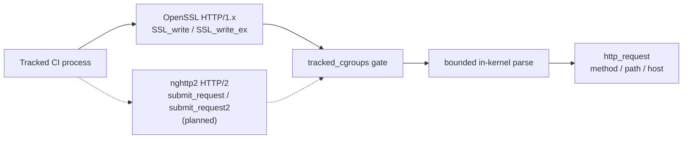
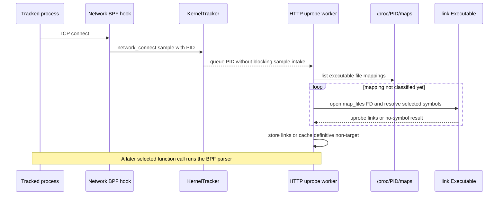
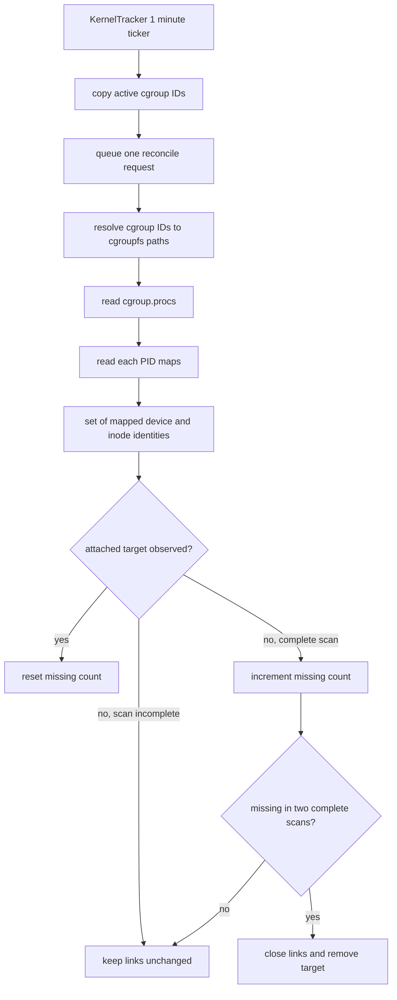

# HTTP Uprobe Coverage

cicd-sensor uses uprobes to observe an HTTP request before a userspace TLS or
HTTP/2 library encrypts or encodes it. Coverage is defined by the library
function that is called, not by a language, package manager, or executable name.

This page records why each function is selected, what has been verified, and
when another function should be added.

## Runtime boundary

The dotted HTTP/2 path is planned work and is not current runtime coverage.
Both paths reuse the existing `http_request` event. Raw request bytes, ordinary
headers, and bodies must not leave the kernel.

Userspace attaches selected symbols on executable file mappings. One worker
owns discovery, links, the non-target cache, and maps-liveness reclaim. The
cgroup is the event gate and scan scope; it does not own an individual link.

## Uprobe lifecycle

An uprobe lets a BPF program run when userspace enters a function at a known
offset in an ELF file. cicd-sensor attaches by mapped file and symbol, not by
PID. Processes that map the same file can therefore share one attachment. The
`tracked_cgroups` check inside the BPF program prevents untracked processes from
emitting events through that attachment.

| Term | Meaning in cicd-sensor |
| --- | --- |
| target | One mapped executable file identified by device and inode. |
| uprobe link | The userspace handle returned for one target symbol. Closing it detaches that symbol. |
| attached target | One target and all of its uprobe links, owned by the HTTP uprobe worker. |
| non-target cache | A bounded cache of files definitively found to contain none of the selected symbols. It owns no links. |

### Connect and attach

A TCP connect is only a discovery signal. It identifies a tracked process whose
current executable mappings should be inspected; the connection itself is not
the uprobe attachment.

The worker coalesces queued PIDs and owns all classification and link state on
one goroutine. For each mapping it applies this decision:

| Result | Action |
| --- | --- |
| target is already attached | Keep the existing links. |
| file is in the non-target cache | Skip symbol resolution. |
| at least one selected symbol attaches | Store the links as one attached target. |
| every selected symbol is absent | Add the file to the bounded non-target cache. |
| permission, I/O, or other transient failure | Store nothing; retry after a later connect. |

The queue is non-blocking so symbol discovery cannot stop ring-buffer intake.
This also means the first request can beat attachment. A later connect is the
normal retry trigger.

### Reconcile and close

An attached link does not disappear when one process exits, and the same mapped
file can be shared by several Jobs or containers. Link lifetime therefore does
not follow one PID or one Job. Every minute, KernelTracker sends the worker an
immutable snapshot of active tracked cgroup IDs. The worker performs the rest
of the sweep asynchronously.

Reconcile only observes liveness and closes stale targets; it does not classify
or attach files. A read failure that could hide a live mapping makes the sweep
incomplete, so it cannot advance a missing count. Two complete misses avoid
detaching during a process or cgroup teardown race.

### Ownership and concurrency

| Owner | Responsibility |
| --- | --- |
| KernelTracker loop | Owns Job/cgroup tracking and copies active cgroup IDs for reconcile. |
| Kernel sample reader | Decodes a TCP connect and queues only its PID. It never scans files or changes links. |
| HTTP uprobe worker | Serially handles connect scans and reconcile requests; exclusively owns attached targets, links, and the non-target cache. |

Because attach and close both run on the same worker goroutine, they cannot race
with each other and do not require a mutex. On shutdown, that worker closes all
remaining links.

## Function selection criteria

A function is added only when all of these conditions hold:

1. It exposes method, path, and host before encryption or protocol encoding.
2. Its public argument ABI is stable on supported 64-bit architectures, and the
   target symbol is resolvable from the mapped ELF's `.symtab` or `.dynsym`.
3. A relevant CI client is known to call it. Symbol presence alone is not
   sufficient.
4. Parsing can stay bounded in eBPF and preserve the redaction invariant.
5. It can reuse the existing event ABI and uprobe discovery/reclaim lifecycle.
6. A real-client privileged E2E demonstrates the intended call path before the
   documentation claims that client as covered.

Adjacent APIs are not hooked preemptively. Add one only after a real workload
shows a coverage gap that the function closes.

## Selected functions

| Function | Status | Why it is selected | Verification |
| --- | --- | --- | --- |
| [`SSL_write`](https://docs.openssl.org/master/man3/SSL_write/) | Implemented; rollout disabled | OpenSSL HTTP/1.x plaintext buffer is argument 2 and length is argument 3. | curl HTTP/1.1 E2E |
| [`SSL_write_ex`](https://docs.openssl.org/master/man3/SSL_write/) | Implemented; rollout disabled | Same buffer and length argument positions as `SSL_write`; required by the observed Python path. | Python `urllib.request` E2E |
| [`nghttp2_submit_request`](https://nghttp2.org/documentation/nghttp2_submit_request.html) | Planned | Exposes the `nghttp2_nv` request headers before HPACK; `nva` is argument 3 and `nvlen` is argument 4. | Implementation and real-client E2E required |
| [`nghttp2_submit_request2`](https://nghttp2.org/documentation/nghttp2_submit_request2.html) | Planned | Same relevant argument positions; complements `submit_request` across nghttp2 versions. | Implementation and real-client E2E required |

The OpenSSL entry program is shared by both OpenSSL symbols. The planned
nghttp2 entry program is likewise shared by its two symbols. A second parser is
not introduced when argument positions and parsing semantics are identical.

The following functions are intentionally not selected:

| Function or stack | Reason |
| --- | --- |
| `SSL_write_early_data`, `SSL_write_ex2` | No verified CI workload requires them. |
| `nghttp2_submit_headers` | No inspected common CI client creates ordinary requests through it; it has a different argument ABI. |
| Go `crypto/tls` / `net/http2` | Does not use the selected OpenSSL or nghttp2 APIs. |
| Java JSSE, Rust rustls / `h2`, Python `h2` | Uses a different TLS or HTTP/2 implementation. |
| BoringSSL and other OpenSSL-like forks | Not part of the supported ABI contract unless separately verified. |

## Workload coverage

Tool names are evidence, not the attachment contract. Distribution builds,
static linking, symbol visibility, protocol negotiation, and library versions
can change the actual function path.

| Workload | Known status | Boundary |
| --- | --- | --- |
| curl over HTTPS HTTP/1.1 | Verified | E2E observes `SSL_write`. |
| Python `urllib.request` over HTTPS HTTP/1.1 | Verified | E2E observes `SSL_write_ex`. |
| pip / requests | Not separately verified | Expected only when their Python/OpenSSL build calls a selected symbol; do not describe them as guaranteed until a real-client E2E is added. |
| Node / npm over HTTPS HTTP/1.x | Not separately verified | [Node's TLS implementation uses OpenSSL](https://nodejs.org/api/tls.html), but that does not guarantee symbol visibility or a specific write API in a particular build. |
| wget over HTTPS HTTP/1.x | Not separately verified | Coverage depends on its build using a selected OpenSSL function rather than another TLS backend. |
| Git over HTTPS | Not separately verified | Its libcurl TLS backend and negotiated HTTP version determine the function path. HTTP/2 support is planned only for nghttp2-backed builds. |
| curl or Node over HTTP/2 | Planned only | Covered only when that build calls one of the selected nghttp2 request APIs. |
| Go `crypto/tls`, Java JSSE, or Rust rustls HTTPS | Not covered | They do not cross a selected uprobe boundary. `domain` and `network_connect` remain available. |
| Python `h2` / httpx HTTP/2 | Not covered | It does not use nghttp2 for request submission. |

## Known limits

- Discovery is best-effort. The first request from a newly observed executable
  can occur before its uprobe is attached.
- A target absent from both `.symtab` and `.dynsym` cannot be attached by name.
- HTTP/1.x parsing starts at one write boundary. Split request lines or a `Host`
  outside the bounded prefix can be missed.
- HTTP/2 is visible only before HPACK in a selected nghttp2 API. HTTP/2 already
  encoded at `SSL_write`, h2c, and HTTP/3/QUIC are not parsed.
- Retries can produce duplicate events. Consumers must not assume exactly-once
  request capture.
- Absence of `http_request` is not proof that no egress occurred. Rules should
  retain `domain` and `network_connect` coverage where appropriate.

## Changing coverage

When adding or removing a function:

1. Record the client, version, linked library, resolved symbol, and protocol.
2. Prove the public argument ABI from primary documentation or source.
3. Reuse an existing BPF entry when the argument contract is identical;
   otherwise justify the additional program and verifier cost.
4. Add a real-client E2E that distinguishes the function path. A synthetic
   symbol fixture verifies parsing and ABI only; it does not prove client
   coverage.
5. Update this matrix and the user-facing `http_request` known gaps together.

## Code map

| Concern | Source |
| --- | --- |
| connect dispatch and reconcile timer | `internal/agent/kerneltracker/engine.go`: `enqueueKernelSample`, `queueHTTPUprobeDiscovery`, `Run` |
| active cgroup snapshot | `internal/agent/kerneltracker/job_tracking_cgroup.go`: `activeCgroupIDs` |
| worker loop | `internal/agent/kerneltracker/kernelio/http_uprobe_discovery.go`: `run` |
| mapping scan and attach | same file: `scanProcessMappings`, `discoverAndAttachTargets`, `classifyAndAttach`, `attachTarget` |
| maps-liveness reclaim | same file: `reconcileTargets`, `resolveActiveCgroupPaths`, `collectCgroupPIDs` |
| shared bounded HTTP parser | `internal/agent/bpf/http_helpers.bpf.h` |
| OpenSSL uprobe programs | `internal/agent/bpf/tls_hooks.bpf.h` |
| current real-client E2E | `internal/agent/kerneltracker/kernel_sample_tls_integration_linux_test.go` |
