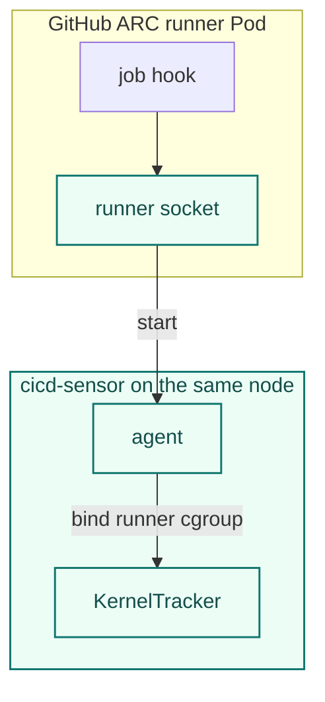
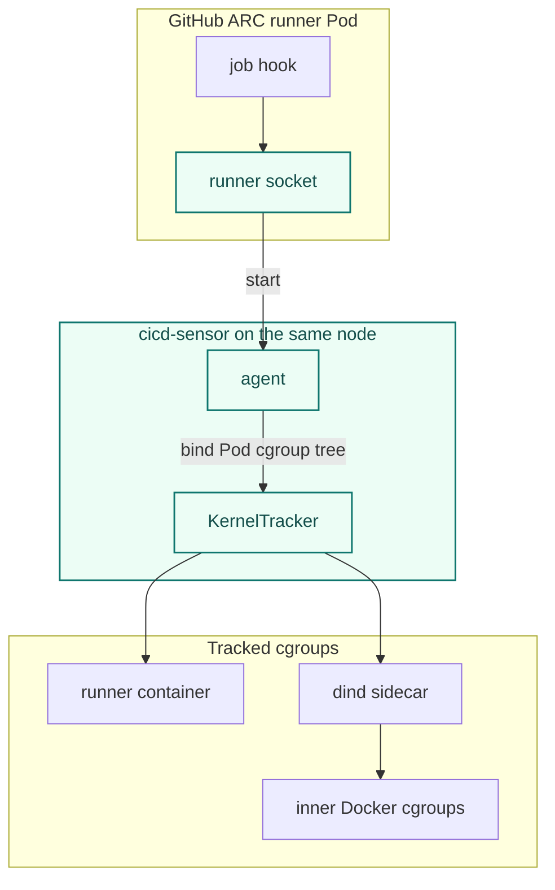
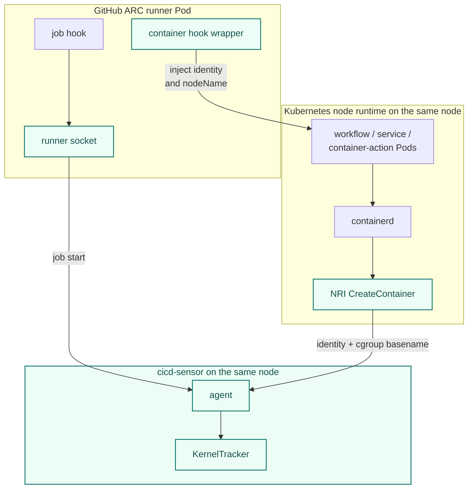
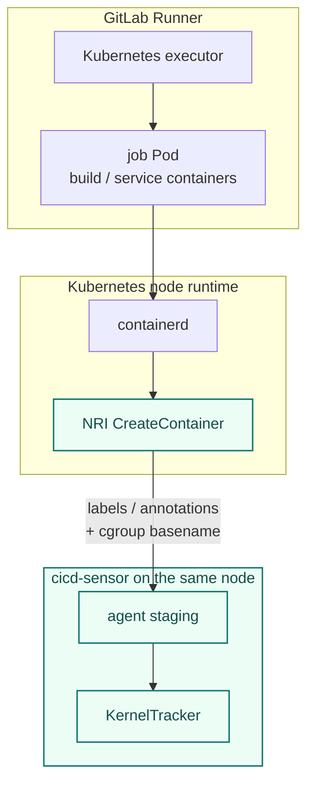

# Kubernetes Runtime

Kubernetes support maps Kubernetes runner workloads onto the existing Agent / JobRegistry / KernelTracker model.
Runner modes are install recipes; the runtime implementation uses NRI and hooks as the core mechanisms.

## Mechanisms

| Mechanism | Used by | Responsibility |
| --- | --- | --- |
| NRI | GitHub ARC Kubernetes mode, GitLab Runner Kubernetes executor | Receives containerd `CreateContainer` events and stages Kubernetes-created container cgroups when job identity is available. |
| Job hook | GitHub ARC default, dind, Kubernetes mode | Runs after GitHub job assignment and calls the GitHub Kubernetes runner socket so cicd-sensor can bind the runner cgroup. |
| Container customization hook wrapper | GitHub ARC Kubernetes mode | Wraps `ACTIONS_RUNNER_CONTAINER_HOOKS` and injects GitHub identity into workflow Pod annotations before ARC creates Kubernetes workflow containers. |

GitHub and ARC references:

| GitHub concept | GitHub docs | cicd-sensor integration point |
| --- | --- | --- |
| ARC runner scale sets | [Deploy runner scale sets](https://docs.github.com/en/actions/how-tos/manage-runners/use-actions-runner-controller/deploy-runner-scale-sets) | The user guide provides mode-specific DaemonSet and Helm values snippets for the official `gha-runner-scale-set` chart. |
| ARC authentication | [Authenticate to the GitHub API](https://docs.github.com/en/actions/how-tos/manage-runners/use-actions-runner-controller/authenticate-to-the-api) | Required before installing the runner scale set; cicd-sensor does not replace ARC authentication. |
| Workflow `runs-on` | [Use ARC runners in a workflow](https://docs.github.com/en/actions/how-tos/manage-runners/use-actions-runner-controller/use-arc-in-a-workflow) | The runner scale set name selected in GitHub is the workflow label users target. |
| Job hooks | [Run scripts before or after a job](https://docs.github.com/actions/hosting-your-own-runners/managing-self-hosted-runners/running-scripts-before-or-after-a-job) | `ACTIONS_RUNNER_HOOK_JOB_STARTED` calls the GitHub Kubernetes runner socket after assignment and before workflow steps. |
| Container customization hooks | [Customize containers used by jobs](https://docs.github.com/en/actions/how-tos/manage-runners/self-hosted-runners/customize-containers) | `ACTIONS_RUNNER_CONTAINER_HOOKS` is wrapped only in ARC Kubernetes mode to inject identity before workflow Pods are created. |

For install order and mode-specific example files, see the [GitHub ARC user guide](../user-guide/kubernetes/github-arc.md).
This page explains why the GitHub hooks and node-level components are needed.

GitLab references:

| GitLab concept | GitLab docs | cicd-sensor integration point |
| --- | --- | --- |
| GitLab Runner Helm chart | [Install GitLab Runner on Kubernetes](https://docs.gitlab.com/runner/install/kubernetes/) | The user guide provides a node-level DaemonSet and a minimal values snippet for the official GitLab Runner chart. |
| Kubernetes executor | [GitLab Runner Kubernetes executor](https://docs.gitlab.com/runner/executors/kubernetes/) | GitLab Runner creates job Pods; cicd-sensor reads their labels and annotations through NRI. |

For install order and example files, see the [GitLab Runner Kubernetes executor user guide](../user-guide/kubernetes/gitlab-runner.md).

## Common runtime mechanisms

### Node runtime requirements

Kubernetes support assumes a node-level privileged DaemonSet on Linux cgroup v2 with containerd, NRI, and runc systemd cgroups.
The agent and NRI containers run as root (`runAsUser: 0`).

The agent needs root/privileged access to load eBPF programs and create BPF maps.
The NRI observer needs root access to connect to the host NRI socket mounted from `/var/run/nri/nri.sock`.
GKE Standard with COS and containerd 2.x has been verified with this model.
GKE Autopilot and other environments that block privileged hostPath node agents are unsupported.

### Host manager config cache

Kubernetes support uses manager-owned host config.
The Agent fetches host manager config before exposing Kubernetes listeners and refreshes it in the background.
Host start and K8s staging paths build host scope from that memory cache.
This keeps containerd NRI callbacks local and bounded; manager unavailability after a successful fetch leaves the last known-good config in use.

### Cgroup staging

Kubernetes support initially requires containerd, runc, and systemd cgroups.
NRI exposes OCI `linux.cgroupsPath` in systemd form, for example:

```text
kubepods-...slice:cri-containerd:<container_id>
```

The NRI handler converts that value to the basename observed by the eBPF `cgroup_mkdir` hook:

```text
cri-containerd-<container_id>.scope
```

That basename is inserted into staging state using the same promotion model as the Docker proxy path.

### Pod cgroup tree bind

GitHub ARC start handling uses the hook peer PID's cgroup path as the kernel-side signal for same-Pod tracking.
This is used mainly for dind, where the runner container and the privileged dind sidecar share a Pod but have different container cgroups.

The agent does not use network or IPC namespace matching for this.
Those namespaces can be changed by Pod settings such as `hostNetwork` or `hostIPC`, and they are not the cgroup ownership boundary that KernelTracker ultimately uses.
The start path also avoids containerd, CRI, and Kubernetes API lookups; those APIs can enrich metadata, but the tracking boundary still comes from `/proc/<pid>/cgroup`.

The bind sequence is:

1. Read the hook peer PID from the runner socket connection.
2. Read `/proc/<pid>/cgroup` and find the kubelet-created Pod cgroup ancestor.
3. Bind the Pod cgroup to the Job.
4. Enumerate existing child cgroups under that Pod cgroup and bind them too.
5. Return the start response after the bind completes.

For the supported kubelet systemd cgroup layout, the Pod cgroup tree looks like this:

```text
/kubepods.slice/kubepods-burstable.slice/kubepods-burstable-pod<uid>.slice/
  cri-containerd-<runner_container_id>.scope
  cri-containerd-<dind_container_id>.scope
```

After the dind sidecar cgroup is tracked, inner Docker cgroups created below that sidecar are picked up by the existing `cgroup_mkdir` / `cgroup_attach_task` propagation path.
This is why the start hook can make dind observable without host NRI seeing the inner Docker lifecycle.

This behavior requires the default kubelet systemd cgroup layout.
Kubernetes documents the [systemd cgroup driver](https://kubernetes.io/docs/setup/production-environment/container-runtimes/#systemd-cgroup-driver) and kubelet [`cgroup-root` / `cgroups-per-qos` flags](https://kubernetes.io/docs/reference/command-line-tools-reference/kubelet/), while the concrete systemd path shape comes from kubelet's implementation of `kubepods` cgroup names.
Custom kubelet cgroup roots, cgroupfs layouts, and distro-specific alternate layouts are outside this support path.

### Socket exposure

Kubernetes job Pods must not receive host `containerd`, CRI, NRI, or cicd-sensor staging sockets.
The NRI staging endpoint is used by the host-side NRI observer.
The GitHub Kubernetes runner socket is mounted only into GitHub ARC runner containers and currently exposes only start behavior.
In ARC default and dind modes, workflow steps run inside the runner container and can reach that socket; the start identity is caller-asserted, see the [listener trust model](agent.md#listener-trust-model).
The container customization hook wrapper does not need cicd-sensor socket access.
Future GitHub Kubernetes project start/result endpoints may use the same runner socket; the normal agent control socket should remain host-side only.
For the exact Agent socket endpoints, see [Agent Architecture](agent.md#listener-endpoints).

### NRI availability

cicd-sensor does not patch or restart containerd to enable NRI.
The Kubernetes installer treats `/var/run/nri/nri.sock` as a preflight requirement.
The install path should fail clearly if the NRI socket is missing instead of mutating node runtime configuration.

containerd restarts close NRI plugin connections, and NRI has no event replay.
The observer reconnects with backoff instead of exiting, but containers created while disconnected are never staged; each `nri_connection_lost` log line marks such a monitoring gap.

## GitHub ARC

### Default mode

When `containerMode` is unset, the job runs in the ARC runner container.
The job hook is the identity point.
NRI sees the runner container before job assignment, so it cannot create the GitHub job identity for default mode.
The hook start request calls the GitHub Kubernetes runner socket, creates the job record, and binds the runner cgroup before workflow steps run.



### dind mode

In dind mode, ARC creates a runner container and a privileged dind sidecar in the same Pod.
Host NRI can see the runner and dind Kubernetes containers, but it does not see the inner Docker lifecycle managed by the dind daemon, so cicd-sensor does not use NRI for this mode.

cicd-sensor uses the job hook as the identity point.
At start time, the hook calls the GitHub Kubernetes runner socket.
The agent reads the hook peer PID's cgroup path, finds the kubelet-created Pod cgroup ancestor, and binds the Pod cgroup tree so the dind sidecar is tracked as part of the job.
Once the dind sidecar cgroup is tracked, inner Docker cgroups created below it are picked up by the existing cgroup propagation path.



### Kubernetes mode

In Kubernetes mode, ARC uses GitHub's container hooks to create workflow job containers, services, and container actions as Kubernetes Pods.
Those Pods need GitHub job identity before NRI can safely stage their cgroups.
The common job hook is still used for job lifecycle tracking.

cicd-sensor uses a small container customization hook wrapper:

1. The runner calls the cicd-sensor wrapper through `ACTIONS_RUNNER_CONTAINER_HOOKS`.
2. The wrapper reads GitHub identity from the hook process environment.
3. The wrapper writes a temporary hook template with cicd-sensor annotations and the runner Pod's `nodeName`.
4. The wrapper delegates to the official ARC Kubernetes hook at `/home/runner/k8s/index.js`.
5. NRI reads the injected annotations during `CreateContainer` and stages the cgroup.

Injected annotations:

| Annotation | Value |
| --- | --- |
| `cicd-sensor.github.io/identity` | JSON identity with provider, repository, run ID, run attempt, and job. |
| `cicd-sensor.github.io/metadata` | JSON metadata such as workflow, ref, SHA, actor, and runner name. |

The container customization hook wrapper does not replace NRI.
It supplies identity before Pod creation; NRI still supplies the runtime cgroup path at container creation time.
Using the hook alone would require post-create Kubernetes API lookup or exposing a staging socket to the runner, and would no longer match the existing cgroup-mkdir staging model.

The wrapper currently generates its own temporary hook template and overwrites
any existing `ACTIONS_RUNNER_CONTAINER_HOOK_TEMPLATE` setting. Operators that
use a custom ARC hook template for security context, labels, or other PodSpec
overrides need to merge those settings into the cicd-sensor wrapper flow before
enabling Kubernetes mode.

ARC Kubernetes mode keeps workflow-created Pods on the same node as the runner Pod.
The wrapper enforces this by setting the workflow Pod's `nodeName` to the runner Pod's node.
Agent state and cgroup tracking are node-local, so the agent that receives the GitHub job start must be the same node agent that receives the NRI `CreateContainer` events for the workflow job, service, and container-action Pods.
This trades scheduler placement flexibility for node-local attribution.
It can concentrate workflow containers, service containers, and container actions on the runner node; if that node lacks capacity, workflow-created Pods can remain pending or fail instead of moving to another node.
Operators should size runner nodes for the combined runner and workflow workload, especially for jobs with service containers or large container actions.



ARC Helm values need manual merging because runner containers, environment variables, volume mounts, and volumes are YAML lists.
Helm replaces lists from later values files instead of merging list entries, so a separate cicd-sensor values file can silently remove either existing runner settings or the cicd-sensor hook settings.

## GitLab Runner Kubernetes executor

GitLab Runner writes CI job information into Kubernetes Pod labels and annotations.
The NRI handler reads those fields from `api.PodSandbox` during `CreateContainer`.

Consumed sources, in identity precedence order:

| Source | Keys | Use |
| --- | --- | --- |
| Pod annotation | `job.runner.gitlab.com/url` | Primary source for provider host and project path. Label values cannot contain `/`, so nested group paths are only available here. |
| Pod annotations | `job.runner.gitlab.com/id`, `job.runner.gitlab.com/name`, `job.runner.gitlab.com/ref`, `job.runner.gitlab.com/sha` | Job ID and commit metadata. |
| Pod labels | `project.runner.gitlab.com/name`, `project.runner.gitlab.com/namespace` | Project path fallback when the job URL annotation is missing; cannot represent nested group paths. |

Container environment variables such as `CI_PROJECT_PATH` and `CI_SERVER_HOST` are last-resort identity fallbacks, and variables such as `CI_PIPELINE_SOURCE` and `CI_COMMIT_SHA` fill metadata.
Job configuration can override environment values, so an identity built from env alone is job-author-influenced; runner-set annotations are preferred for identity fields.

Default container handling:

| GitLab Runner container | Handling |
| --- | --- |
| `build` | Monitored. |
| user-defined service containers | Monitored as part of the same CI job. |
| `helper` | Skipped by default. |
| `init-permissions` | Skipped by default. |

Containers without enough trusted Pod metadata to build a job identity are skipped.

GitLab Kubernetes staging is a single local agent call.
If the Job does not exist yet, the staging handler creates it from the cached host manager config and then stages the cgroup basename.
The NRI observer does not call `/v1/gitlab/host/start` and does not fetch manager config remotely.


