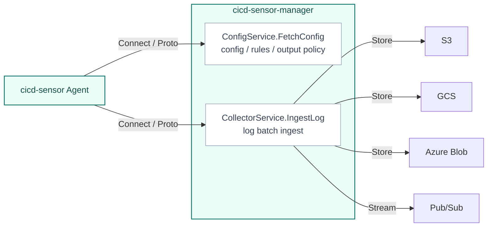

# Manager Architecture

The Manager is the optional server component that operators deploy when they want to run cicd-sensor across a runner fleet.
It centralizes config delivery, rule delivery, and log routing, so individual CI/CD jobs do not need to carry rule bundles or cloud output credentials.

The Manager is not a runtime sensor.
Agents still observe CI/CD runtime activity and evaluate rules locally in each job or host scope.
The Manager provides the operational boundary for distributing policy and receiving the resulting logs.

## Agent to Manager protocol

cicd-sensor uses the gRPC-based [Connect protocol](https://connectrpc.com/) with Protocol Buffers for Agent-to-Manager communication.
Connect keeps the typed protobuf contract while allowing the same services to run over HTTP/1.1 and HTTP/2.
This is the main reason cicd-sensor uses Connect rather than plain gRPC: plain gRPC generally assumes HTTP/2, while Connect can run through infrastructure that only supports HTTP/1.1.

HTTP/1.1 support makes the Manager easier to place behind load balancers that do not support HTTP/2 and easier to adapt to serverless environments such as AWS Lambda.
The wire schema is defined in [`proto/cicd_sensor/manager/v1beta1`](https://github.com/cicd-sensor/cicd-sensor/tree/main/proto/cicd_sensor/manager/v1beta1).

The Manager exposes two endpoints to Agents.

| Service | Method | Purpose |
| --- | --- | --- |
| `ConfigService` | `FetchConfig` | Agent fetches config, rule source, and output policy |
| `CollectorService` | `IngestLog` | Agent sends gzip-compressed JSONL log batches to the manager |

The Agent treats the Manager bearer token as an opaque credential and does not validate its format.
This allows third-party Manager implementations to define their own token format.
The built-in Manager accepts the `sk_cs_` token format generated by `cicd-sensorctl token generate` and validates it on each request.

## Config and rule delivery

Agents fetch config and rules with `ConfigService.FetchConfig`.
In manager mode, repository-local `.cicd-sensor/config.yaml` and `.cicd-sensor/rules/` are not used.
The manager config owns manager-backed baseline policy, default alert caps, and output policy.
For the user-facing `manager.yaml` setting reference, see [Manager](../user-guide/manager.md#manageryaml).

`FetchConfig` output is host-scope policy.
It may depend on provider and manager-global config, but it must not depend on job-specific fields such as project path, workflow name, or CI job ID.
Agents may cache host-scope `FetchConfig` results node-wide and apply the real job identity later during rule resolution and log emission.

Startup config is read once at process start.
Rules are checked on each `FetchConfig` request: if the rule bundle file's modification time or size has changed, it is re-parsed; otherwise the cached parse is reused.
Rule updates therefore take effect by replacing the file on disk, without restarting the Manager.

The Manager process accepts file locations through either CLI flags or environment variables.

| Input | CLI flag | Environment variable | Reload behavior |
| --- | --- | --- | --- |
| Startup config | `--config-file` | `CICD_SENSOR_MANAGER_CONFIG_FILE` | Read at process start |
| Rule bundle | `--rules-file` | `CICD_SENSOR_MANAGER_RULES_FILE` | Rechecked on each `FetchConfig` request |

Only file locations are accepted through this CLI / environment interface.
The settings themselves live in `manager.yaml`; custom rules live in the rule bundle file.

Rule sources returned by the Manager are resolved into scope-local rules and compiled by the Agent.
The Manager holds the rule bundle, but it does not evaluate runtime events.

## Log ingest and outputs

Agents send Summary Logs, Detection Logs, and Runtime Event Logs to `CollectorService.IngestLog` as gzip-compressed JSONL batches.
The Manager delivers them to sinks such as S3, GCS, Azure Blob, or Pub/Sub according to the routing policy for each log type.

The Manager treats the log batch as the delivery unit.
It does not interpret runtime events or evaluate detections.

Cloud credentials are held only by the Manager process.
Agents do not receive cloud credentials.

## GitHub Actions OIDC authentication (project scope)

Agent → Manager auth has two modes:

1. **Manager token** (`sk_cs_…`): the default. Used outside GitHub Actions, and on Actions when OIDC is not selected.
2. **GitHub Actions OIDC ID token**: a short-lived JWT. Used when the Agent runs inside a GitHub Actions job that can mint ID tokens (`permissions: id-token: write` and the runner request URL/token env vars).

Agents in GitHub Actions workflows may send an OIDC ID token instead of a long lived `sk_cs_` secret.
Self hosted Actions runners can mint the same way when the job grants `id-token`.
GitHub hosted VM teardown is a separate shutdown hazard (minting can fail after the job ends); it is not a requirement for using OIDC.

Both modes still send `Authorization: Bearer …`. `Cicd-Sensor-Token-Type` says which credential it is:

| HTTP header | Manager token | OIDC ID token |
| --- | --- | --- |
| `Authorization` | `Bearer sk_cs_…` | `Bearer <jwt>` |
| `Cicd-Sensor-Token-Type` | `manager-token` (or omit; absent means manager token) | `id-token` |

Network and minting:

- Manager verifies JWTs locally with configured `issuer`, `audience`, and `jwks_url` (no issuer discovery at startup).
- Agent mints with **GET** to the runner `request_url`, after checking **https** and a startup host allowlist (default `*.actions.githubusercontent.com`).
- Mint HTTP has a **10s** timeout and **does not follow redirects** (3xx fails the mint).
- Concurrent RPCs share one in-flight mint. Each RPC wait follows its own context (`Canceled` / `DeadlineExceeded`); the mint itself has a separate bound and is canceled after the final Summary flush.

Shutdown / lifetime:

- On GitHub-hosted runners, a fresh mint during VM teardown after the job can return HTTP 400. `project result` **force-refreshes** while minting still works, then seeds `ReuseTokenSourceWithExpiry(..., 60s)` so later RPCs still honor JWT expiry.
- Never log `ACTIONS_ID_TOKEN_REQUEST_TOKEN` or manager bearer tokens (Agent logs, debug bundles, or Manager audit). Log only `auth_kind` and matched claim metadata.

## Design rules

- Treat the Manager as a stateless config server and log router.
- Replicas with the same startup config, rule bundle, tokens, and cloud credentials can scale horizontally.
- Authentication validates the bearer token on each request.
- Token, startup config, and output routing reload by process restart. Rule bundle changes are picked up on the next `FetchConfig` request without a restart.
- TLS is not terminated inside the Manager process. Termination belongs to Ingress, load balancer, service mesh, or private network infrastructure.
