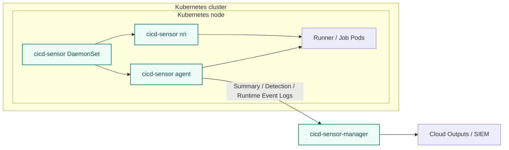

# Kubernetes runner install

Kubernetes support is in development.
This page describes the planned install shape and operational cautions.

For Kubernetes runners, cicd-sensor runs at the node level and uses cicd-sensor Manager for config, rules, and log delivery.
Runner workloads do not mount host container runtime sockets or cicd-sensor internal sockets.

## Supported setups

| CI/CD system | Runner environment | Setup page | Status |
| --- | --- | --- | --- |
| GitHub Actions | ARC runner scale set on Kubernetes | [GitHub ARC runner scale sets](github-arc.md) | In development |
| GitLab CI/CD | GitLab Runner Kubernetes executor | [GitLab Runner Kubernetes executor](gitlab-runner.md) | In development |

## Basic architecture

cicd-sensor uses a node-level DaemonSet for the shared Kubernetes setup.
The agent runs on each node, monitors Kubernetes runner workloads on that node, and sends logs to cicd-sensor Manager.
Modes that create Kubernetes job containers also run the NRI observer on each node.



## Node requirements

Kubernetes nodes must provide:

- Linux with cgroup v2.
- containerd with NRI enabled.
- runc systemd cgroups.
- A privileged node-level cicd-sensor DaemonSet running as root (`runAsUser: 0`).
- Host cgroup v2 mounted into the agent container.

cicd-sensor does not patch or restart containerd.
Before installing the DaemonSet, verify that the node already exposes the NRI socket:

```sh
test -S /var/run/nri/nri.sock
```

GKE Standard with COS, containerd 2.x, and systemd cgroups has been verified.
Managed Kubernetes environments that do not allow privileged node agents or required host mounts are not supported.
This includes GKE Autopilot and managed container services outside Kubernetes, such as Amazon ECS.

## cicd-sensor components

Kubernetes runner deployments use:

| Component | Role |
| --- | --- |
| cicd-sensor DaemonSet | Runs the agent and NRI observer on each node. |
| host cgroup v2 mount | Lets the agent attach and track job cgroups from the host cgroup hierarchy. |
| cicd-sensor Manager | Provides config, rules, and log delivery. |

## YAML

Use the mode-specific examples listed on the [GitHub ARC runner scale sets](github-arc.md) and [GitLab Runner Kubernetes executor](gitlab-runner.md) pages.

## Security notes

Do not mount host `containerd.sock`, CRI socket, NRI socket, or cicd-sensor staging socket into CI/CD job Pods.
Those sockets are host-control surfaces, and exposing them to jobs makes the Kubernetes boundary substantially weaker.

GitHub ARC dind mode requires a privileged dind sidecar.
cicd-sensor can track that mode, but the deployment should be treated as a higher-risk compatibility mode.

For implementation details, see [Kubernetes Runtime](../../developer-guide/kubernetes-runtime.md).

## Next pages

- [GitHub ARC runner scale sets](github-arc.md)
- [GitLab Runner Kubernetes executor](gitlab-runner.md)
