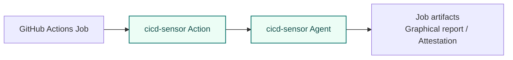
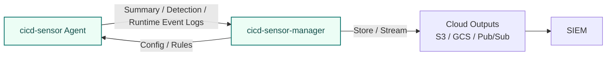

# User Guide Overview

This guide explains how to deploy cicd-sensor into CI/CD pipelines and use it for runtime detection, recording, and verification.

The first decision is the runner environment you want to protect.

## What to read

| Deployment path | CI/CD | Runner environment | Start here | What you get |
| --- | --- | --- | --- | --- |
| GitHub-hosted | GitHub Actions | GitHub-hosted runner | [GitHub-hosted runner](github-hosted.md) | Graphical report and runtime-trace attestation predicate. Log delivery is also available when using the manager. |
| Machine runner | GitHub Actions | Self-hosted runner on a machine | [Machine runner install](self-hosted-install.md), then [GitHub Actions machine runner](github-self-hosted.md), plus [Manager](manager.md) | Summary Log, Detection Log, Runtime Event Log, and graphical report |
| Machine runner | GitLab CI/CD | GitLab Runner Docker executor | [Machine runner install](self-hosted-install.md), then [GitLab Runner Docker executor](gitlab-ci.md), plus [Manager](manager.md) | Summary Log, Detection Log, and Runtime Event Log |
| Kubernetes runner | GitHub Actions | ARC runner scale set on Kubernetes | [Kubernetes runner install](kubernetes/index.md), then [GitHub ARC runner scale sets](kubernetes/github-arc.md), plus [Manager](manager.md) | Preview support. Summary Log, Detection Log, Runtime Event Log, and Kubernetes container tracking |
| Kubernetes runner | GitLab CI/CD | GitLab Runner Kubernetes executor | [Kubernetes runner install](kubernetes/index.md), then [GitLab Runner Kubernetes executor](kubernetes/gitlab-runner.md), plus [Manager](manager.md) | Preview support. Summary Log, Detection Log, Runtime Event Log, and Kubernetes container tracking |
| Rules | Rule author / SIRT | Rule authoring | [Rules](rules.md) | Detection, collection, and correlation rules for CI/CD runtime events |
| Logs | Log consumer / SIEM integration | Log delivery | [Logging](logging.md) | Log format delivered by the manager |

## Usage models

### GitHub-hosted runner

On GitHub-hosted runners, add `cicd-sensor/cicd-sensor-action` to the workflow.
The agent starts inside the job and observes runtime activity from the following steps.

When a manager is configured, GitHub-hosted runners can also deliver Summary Logs, Detection Logs, and Runtime Event Logs to cloud-side outputs.
The job can still produce report and attestation artifacts.

### Machine runners with Manager

For GitHub Actions self-hosted runners on machines and GitLab Runner Docker executor fleets, install the cicd-sensor Agent and Docker proxy on the runner host, then use the manager for config, rules, and log delivery.

In machine runner deployments, config and rules come from the manager, not from the local repository.

### Kubernetes runner scale sets and executors with Manager

For Kubernetes-based runners, install the cicd-sensor Agent as a node-level DaemonSet and use the manager for config, rules, and log delivery.
The manager relationship is the same as machine runner deployments: the manager provides config and rules, and the Agent sends logs back to the manager.

See [Kubernetes runner install](kubernetes/index.md) for the shared node setup, [GitHub ARC runner scale sets](kubernetes/github-arc.md) for GitHub Actions modes, and [GitLab Runner Kubernetes executor](kubernetes/gitlab-runner.md) for GitLab.

## Platform support

| Platform | Environment | Status |
| --- | --- | --- |
| GitHub Actions | GitHub-hosted runner | Supported target |
| GitHub Actions | Self-hosted runner on a machine | Supported target |
| GitHub Actions | [ARC runner scale set on Kubernetes](kubernetes/github-arc.md) | Preview support |
| GitLab CI/CD | GitLab Runner Docker executor | Supported target |
| GitLab CI/CD | [GitLab Runner Kubernetes executor](kubernetes/gitlab-runner.md) | Preview support |
| GitLab CI/CD | Self-hosted Shell executor | Not planned |
| GitLab CI/CD | GitLab-hosted runner | Not supported due to technical constraints |

GitLab-hosted runners are not supported today because cicd-sensor cannot install the Agent on the runner host.
